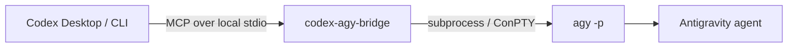

<div align="center">

# Codex x Antigravity

### A local MCP bridge that connects Codex planning with the headless `agy` CLI

<p>
  <a href="https://github.com/crazyzhang277/codex-antigravity-bridge"></a>
  <a href="https://www.python.org/"></a>
  <a href="https://modelcontextprotocol.io/"></a>
  <a href="https://github.com/google-antigravity/antigravity-cli"></a>
</p>

<p><strong>Define scope. Authorize clearly. Review the result.</strong></p>

<p>
  <a href="#quick-start">Quick start</a> ·
  <a href="#runtime-modes">Runtime modes</a> ·
  <a href="#tool-api">Tool API</a> ·
  <a href="#collaboration-rules">Collaboration rules</a> ·
  <a href="#documentation-map">Documentation map</a> ·
  <a href="README.md">Chinese overview</a>
</p>

<p>
  <a href="PROGRESS.en.md">English progress</a> ·
  <a href="docs/README.en.md">Documentation index</a> ·
  <a href="mcp-antigravity-bridge/README.md">Runtime technical manual</a>
</p>

</div>

> [!IMPORTANT]
> **CLI-only.** This project invokes Antigravity's headless `agy` CLI. It does
> not launch, embed, or control the Antigravity desktop GUI.

> [!WARNING]
> **Important for users who route Codex through CC Switch.** CC Switch is not
> required by this project. It is an optional provider switcher and local proxy
> takeover tool. During restart, startup recovery, proxy-takeover recovery, or
> re-takeover after an abnormal exit, CC Switch may regenerate and overwrite
> `%USERPROFILE%\.codex\config.toml`. This can remove `[mcp_servers.*]`,
> `[desktop]`, `[memories]`, project settings, and other Codex UI settings.
> An MCP server shown as enabled in CC Switch's database is not proof that it
> is present in the live Codex configuration.

### Check and Recover MCP After CC Switch

After restarting CC Switch or switching providers, check the configuration that
Codex actually reads in PowerShell:

```powershell
codex mcp list
Get-Content "$env:USERPROFILE\.codex\config.toml"
```

- If `codex-agy-bridge` is missing from `codex mcp list`, Codex did not load this MCP.
- If `[mcp_servers.codex-agy-bridge]` is absent from `config.toml`, CC Switch likely overwrote the live configuration.
- If CC Switch shows the server as enabled but `codex mcp list` does not, its database state was not projected into Codex's live config.
- If an existing conversation still works but a new one does not, the MCP was likely loaded only when the old conversation was created.

For temporary recovery, let CC Switch finish taking over the proxy first, then
register the MCP with Codex CLI. On Windows, replace the example with the real
path to `python.exe` on the local machine:

```powershell
$python = "C:\path\to\python.exe"
codex mcp add codex-agy-bridge -- $python -m codex_agy_bridge

# Restore CodeGraph too, only if it is installed separately:
codex mcp add codegraph -- codegraph serve --mcp

codex mcp list
```

Recommended order: start or restart CC Switch and wait for proxy takeover;
register the MCP; verify `codex mcp list`; then create a new Codex conversation.
Provider hot-switching and a CC Switch restart use different paths. A hot switch
may leave MCP entries intact, while the current restart/re-takeover path may
overwrite them, so verify after every CC Switch restart.

This is a CC Switch configuration-ownership problem, not an MCP protocol issue
in this bridge. See [CC Switch issue #6265](https://github.com/farion1231/cc-switch/issues/6265)
for the Windows reproduction, logs, and proposed fixes. Related discussions:
[#6017](https://github.com/farion1231/cc-switch/issues/6017),
[#4254](https://github.com/farion1231/cc-switch/issues/4254), and
[#4699](https://github.com/farion1231/cc-switch/issues/4699).

## At A Glance

Codex remains responsible for planning, task boundaries, review, testing, and
merging. The bridge exposes six local MCP tools and starts bounded `agy -p`
processes. Collaboration tasks use separate branches and Git worktrees.



<a id="runtime-modes"></a>

## Runtime Modes

The project has four runtime modes. `headless` and `terminal` are display
options, not additional development modes. Supervisor mode is Codex's safety
and acceptance workflow, not a fifth agy process mode.

| Mode | Entry point | Tasks | Does Codex continue? | Worktree requirement | Best for |
| --- | --- | :---: | :---: | --- | --- |
| Normal Codex development | No agy tool | 0 | Yes | Current worktree | Ordinary development without delegation |
| Synchronous delegation | `agy_ask` / `agy_ask_json` | 1 | No, waits | Caller-selected or inherited directory | One-shot analysis or structured output |
| Async isolated task | `agy_start` / `agy_status` | 1 per job | Yes | Caller creates an isolated worktree | One independent delegated task |
| Collaboration MVP | `agy_collab_start` / `agy_collab_status` | 1 by default, 4 maximum | Yes | Bridge creates one worktree per task | Independent frontend, backend, or test tracks |

### Display options

| Display mode | Default | Behavior | Platform |
| --- | :---: | --- | --- |
| `headless` | Yes | No window; status and final output return through MCP | Windows, macOS, Linux |
| `terminal` | No | One visible console per running task shows live agy output | Windows |

The terminal display is an optional collaboration setting. It does not change
task isolation, branches, permissions, or acceptance responsibility.

### Governance rules

- Normal development never invokes agy automatically.
- The user must explicitly request delegation or collaboration first.
- Codex owns task splitting, shared contracts, file boundaries, tests, and manual merges.
- A session is capped at four tasks; each task gets one agy process, branch, and worktree.
- `ready_for_review` means only that agy exited successfully; it is not acceptance proof.
- The bridge never auto-merges, deletes worktrees, or executes arbitrary task commands.

<a id="quick-start"></a>

## Quick Start

### 1. Install prerequisites

- Python 3.10 or newer.
- Antigravity CLI installed as `agy`.
- One completed interactive `agy` login.
- Codex Desktop or Codex CLI with MCP support.

On Windows PowerShell:

```powershell
irm https://antigravity.google/cli/install.ps1 | iex
agy --version
agy
```

On macOS or Linux, follow the [Antigravity CLI documentation](https://antigravity.google/docs/cli/overview), then run `agy` once to complete login.

### 2. Install and register the bridge

From the repository root:

```powershell
git clone https://github.com/crazyzhang277/codex-antigravity-bridge.git
cd codex-antigravity-bridge
powershell -ExecutionPolicy Bypass -File .\scripts\install.ps1
```

For a manual package install:

```powershell
python -m pip install -e ".\mcp-antigravity-bridge[dev,winpty]"
codex mcp add codex-agy-bridge -- python -m codex_agy_bridge
codex mcp list
```

The repository installer also installs the `agy-supervisor` skill and writes a
per-user Codex MCP entry. It resolves a real Python executable on Windows and
does not install or store Antigravity OAuth credentials.

### Proxy and login behavior

The installer detects environment variables, Windows system proxy settings, and
common local proxy listeners. The bridge checks the current proxy before each
agy call and caches discovery for about 60 seconds; it does not start a
background service.

Use `AGY_PROXY_URL`, `PROXY_URL`, or `HTTP_PROXY` / `HTTPS_PROXY` / `ALL_PROXY`
for an explicit proxy. If automatic detection cannot find one, pass a complete
address such as `http://127.0.0.1:7897` or `socks5://127.0.0.1:1080`:

```powershell
powershell -ExecutionPolicy Bypass -File .\scripts\install.ps1 -ProxyUrl "http://127.0.0.1:7897"
```

`AGY_PROXY_ERROR` means the proxy or TUN path needs attention. Only
`AGY_LOGIN_REQUIRED` requires an interactive `agy` login through a working
proxy. Changing proxy software normally does not clear agy's stored login.

For manual Windows MCP configuration, use the absolute path to a real Python
executable. Do not rely on a `python` command that may resolve to the Microsoft
Store shim.

<a id="tool-api"></a>

## Tool API

| Tool | Best for | Result |
| --- | --- | --- |
| `agy_ask` | One bounded synchronous task | Cleaned text |
| `agy_ask_json` | Structured CLI output | Valid JSON text |
| `agy_start` | Explicit work in a caller-created worktree | `job_id` |
| `agy_status` | Polling an async job | Status and result JSON |
| `agy_collab_start` | Starting bounded tasks in isolated worktrees | Collaboration JSON |
| `agy_collab_status` | Aggregating task, worktree, and diff status | Collaboration JSON |

All public task tools require a positive finite `timeout` in seconds. The default is
`300.0`; `agy_collab_start` defaults to `900.0`. Permission bypass is disabled
by default.

### Synchronous tools

```text
agy_ask(
  prompt: str,
  workdir: str = "",
  timeout: float = 300.0,
  dangerously_skip_permissions: bool = False,
) -> str

agy_ask_json(
  prompt: str,
  workdir: str = "",
  timeout: float = 300.0,
  dangerously_skip_permissions: bool = False,
) -> str
```

`agy_ask_json` adds `--output-format json`, rejects nonzero exits, and rejects
unparseable output. The requested JSON schema still belongs in the prompt and
must be checked by the supervisor.

### Async tools

`agy_start` requires an existing caller-created isolated worktree. The bridge
never creates one for this entry point. Poll the returned id with `agy_status`.

| State | Meaning |
| --- | --- |
| `queued` | Accepted and waiting to run |
| `running` | Antigravity process is active |
| `completed` | Process finished successfully |
| `failed` | Process finished with an error |
| `unknown` | Job is unavailable in this bridge process |

Job state is kept in memory. A bridge restart makes old job ids unavailable.

<a id="collaboration-mvp"></a>

<a id="collaboration-rules"></a>

## Collaboration MVP

Use collaboration only when tasks have exclusive file ownership and a known
shared contract. Every task must provide `id`, `prompt`, `owned_paths`, and
`acceptance`; `verification` is optional. Owned paths may not overlap.

```text
agy_collab_start(
  project_dir="C:/work/my-app",
  shared_contract="Frontend consumes GET /api/items.",
  display_mode="headless",
  max_tasks=4,
  tasks=[
    {
      "id": "backend",
      "prompt": "Implement the items API and its tests.",
      "owned_paths": ["backend"],
      "acceptance": ["API tests pass"],
      "verification": ["python -m pytest backend"],
    },
    {
      "id": "frontend",
      "prompt": "Implement the items page against the shared contract.",
      "owned_paths": ["frontend"],
      "acceptance": ["Frontend tests pass"],
    },
  ],
)
```

The bridge creates one temporary branch, worktree, and agy process per task.
`agy_collab_status(session_id)` reports job state, branch, worktree path,
changed files, uncommitted changes, and `diff_check`. `ready_for_review` is
only a handoff point; Codex must inspect each worktree, run acceptance checks,
and merge branches manually.

The MVP never auto-merges, deletes worktrees, or runs arbitrary verification
commands. Before starting, Codex should ask whether the user wants visible
terminal output and how many tasks to dispatch. The default is one headless
task and the hard limit is four.

## Runtime Behavior

The runtime lives in `mcp-antigravity-bridge/src/codex_agy_bridge/`:

1. `server.py` registers the six MCP tools with FastMCP.
2. `agy_runner.py` discovers `agy` through `AGY_PATH`, `PATH`, and platform defaults.
3. The runner builds `agy -p <prompt>` and optionally adds JSON output or permission bypass.
4. Windows non-ASCII workdirs use an ASCII short path when available.
5. Empty direct output triggers a ConPTY or POSIX `pty` retry.
6. ANSI escapes, carriage-return repainting, and TUI decoration are removed.
7. Nonzero exits, stderr, PTY failures, and empty-output failures remain actionable.
8. `agy_jobs.py` manages bounded async jobs and finite result retention.
9. `agy_collaboration.py` validates contracts, creates worktrees, and aggregates review metadata.

## Configuration

If `agy` is not on `PATH`, set `AGY_PATH`:

```powershell
$env:AGY_PATH = "C:\path\to\agy.exe"
```

The manual example is in [mcp-antigravity-bridge/examples/codex-config.toml](mcp-antigravity-bridge/examples/codex-config.toml).

## Safety Boundary

- Communication stays on local MCP stdio.
- `dangerously_skip_permissions` defaults to `false`.
- Use the bypass only for explicitly authorized, trusted, and reversible tasks.
- Do not delegate production operations, secrets, irreversible actions, cross-project writes, or unclear work.
- OAuth credentials, proxy credentials, and private Codex configuration are not stored or forwarded.

## Verification

```powershell
# Bridge tests and compilation
cd mcp-antigravity-bridge
python -m pytest -q
python -m compileall -q src

# Repository checks
cd ..
python -m pytest -q
python scripts/validate_skill.py
git diff --check
```

The tests mock the process boundary and do not require a live Antigravity login.
For a layered real-machine check, run `agy -p "Reply exactly AGY_OK"`, confirm
`codex mcp list`, and then call `agy_ask` with a small reversible task.

<a id="documentation-map"></a>

## Documentation Map

| Need | Start here |
| --- | --- |
| Chinese project overview | [README.md](README.md) |
| English project overview | [README.en.md](README.en.md) |
| Chinese project progress | [PROGRESS.md](PROGRESS.md) |
| English project progress | [PROGRESS.en.md](PROGRESS.en.md) |
| Runtime installation and troubleshooting | [mcp-antigravity-bridge/README.md](mcp-antigravity-bridge/README.md) |
| All documentation links | [docs/README.en.md](docs/README.en.md) |
| AGY behavior and safety rules | [skills/agy-supervisor/SKILL.md](skills/agy-supervisor/SKILL.md) |
| Design history and plans | [docs/superpowers/](docs/superpowers/) |
| Research notes | [research/codex-antigravity-cases.md](research/codex-antigravity-cases.md) |

## Project Structure

```text
.
├── mcp-antigravity-bridge/       # Local MCP runtime and technical manual
├── skills/agy-supervisor/        # Codex supervisor skill
├── scripts/                      # Cross-platform installers and validator
├── tests/                        # Skill and distribution tests
├── docs/                         # Indexes and design history
├── research/                     # Research notes
├── README.md                     # Chinese overview
├── README.en.md                  # English overview
├── PROGRESS.md                   # Chinese progress
└── PROGRESS.en.md                # English progress
```

## References

- [Antigravity CLI](https://github.com/google-antigravity/antigravity-cli)
- [Antigravity CLI documentation](https://antigravity.google/docs/cli/overview)
- [Model Context Protocol](https://modelcontextprotocol.io/)

## License

Apache-2.0
