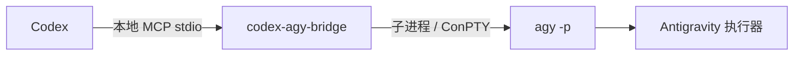
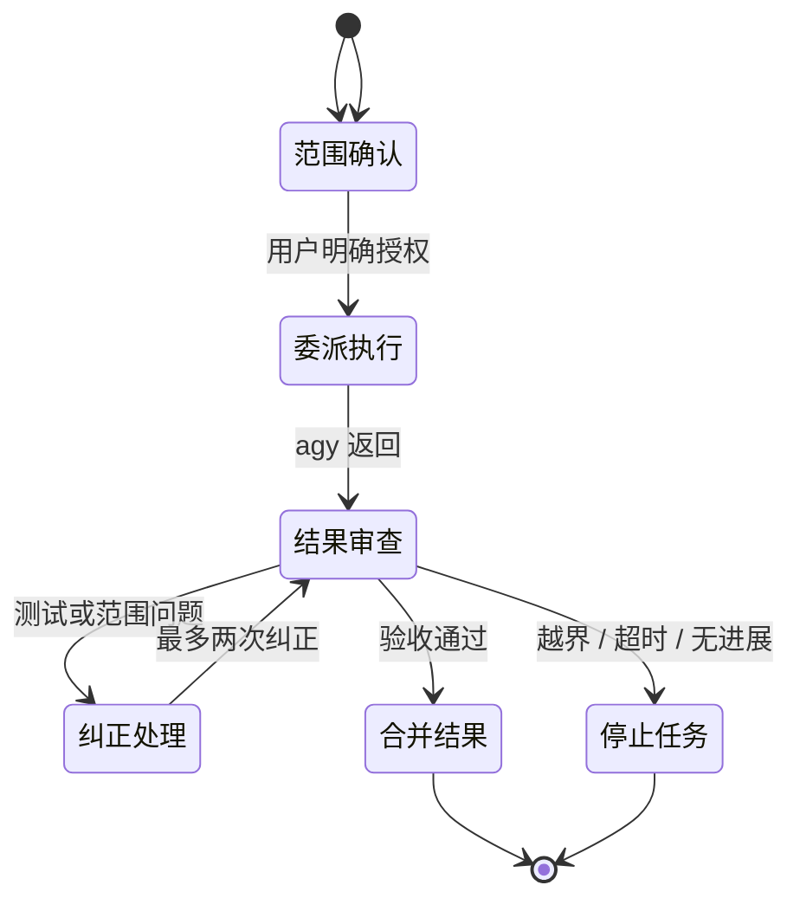

<div align="center">

# Codex <sup>×</sup> Antigravity

### 一个把 Codex 的判断力与 `agy` 的执行力接起来的本地 MCP 桥接器

<p>
  <a href="https://github.com/crazyzhang277/codex-antigravity-bridge"></a>
  <a href="https://www.python.org/"></a>
  <a href="https://modelcontextprotocol.io/"></a>
  <a href="https://github.com/google-antigravity/antigravity-cli"></a>
</p>

<p><strong>规划清晰 · 授权明确 · 验收完整</strong></p>

<p>
  <a href="#quick-start">快速开始</a> ·
  <a href="#mode-overview">模式总览</a> ·
  <a href="#tools">工具</a> ·
  <a href="#supervisor-mode">监督模式</a> ·
  <a href="README.en.md">英文项目首页</a> ·
  <a href="docs/README.md">文档索引</a> ·
  <a href="mcp-antigravity-bridge/README.md">运行时技术手册</a>
</p>

</div>

> [!IMPORTANT]
> **仅使用命令行。** 本项目只调用 Antigravity 的无界面 `agy` 命令行，不启动、嵌入或控制 Antigravity 桌面应用。

> [!WARNING]
> **使用 CC Switch 中转 Codex 的用户必读。** CC Switch 不是本项目的必需依赖，它只是部分用户用来切换供应商或接管 Codex 本地代理的工具。CC Switch 在重启、开机恢复、代理接管恢复或异常退出后的重新接管过程中，可能重新生成并覆盖 `%USERPROFILE%\.codex\config.toml`。这可能删除 `[mcp_servers.*]`、`[desktop]`、`[memories]`、项目配置和其他 Codex UI 设置。即使 CC Switch 的 MCP 管理页面仍显示服务器已启用，也不代表服务器已经写入 Codex 实际读取的配置。

### CC Switch 中转后的检查与恢复

每次重启 CC Switch 或更换供应商后，都建议在 PowerShell 中检查实际配置：

```powershell
codex mcp list
Get-Content "$env:USERPROFILE\.codex\config.toml"
```

- `codex mcp list` 没有 `codex-agy-bridge`：当前 Codex 没有加载本项目的 MCP。
- 配置文件没有 `[mcp_servers.codex-agy-bridge]`：通常是 CC Switch 覆盖了 live 配置。
- CC Switch 数据库里显示已启用，但 `codex mcp list` 没有：数据库状态没有同步到 Codex 的实际配置。
- 旧对话仍能调用、新对话不能调用：MCP 可能只在旧对话创建时加载过，先修复配置再新建对话。

临时恢复本项目 MCP 时，先让 CC Switch 完成代理接管，再使用 Codex CLI 注册。Windows 请把 Python 路径替换为本机真实的 `python.exe` 路径；不要把下面的示例路径当作固定路径：

```powershell
$python = "C:\path\to\python.exe"
codex mcp add codex-agy-bridge -- $python -m codex_agy_bridge

codex mcp list
```

推荐顺序是：重启或启动 CC Switch，等待代理接管完成；注册 MCP；确认 `codex mcp list`；最后再新建 Codex 对话。供应商热切换和重启 CC Switch 不是同一条代码路径，热切换不一定删除 MCP，但当前版本的重启/恢复接管路径可能再次覆盖配置，因此每次重启后都要复查。

这是 CC Switch 的配置接管问题，不是本桥接器的 MCP 协议问题。详细复现、日志和修复建议见 [CC Switch issue #6265](https://github.com/farion1231/cc-switch/issues/6265)；相关讨论还包括 [#6017](https://github.com/farion1231/cc-switch/issues/6017)、[#4254](https://github.com/farion1231/cc-switch/issues/4254) 和 [#4699](https://github.com/farion1231/cc-switch/issues/4699)。

## 🧭 一眼看懂

| Codex | 本地桥接器 | Antigravity |
| :---: | :---: | :---: |
| 规划 · 拆分 · 验收 | MCP · 权限边界 · 独立工作区 | 实现 · 测试 · 返回结果 |



<a id="mode-overview"></a>

## 🧭 模式总览

这个项目有 **4 种运行模式**。`headless` 和 `terminal` 是显示方式，
不是额外的开发模式；`监督模式` 是 Codex 的安全与验收规则，也不是另一
个 agy 进程模式。

| 模式 | 使用入口 | 任务数量 | Codex 是否继续写代码 | worktree 要求 | 适用场景 |
| --- | --- | :---: | :---: | --- | --- |
| ① Codex 普通开发 | 不调用 agy | 0 | 是 | 当前工作区 | 只让 Codex 完成任务；不会自动调用 agy |
| ② 单次同步委派 | `agy_ask` / `agy_ask_json` | 1 | 否，等待返回 | 调用方指定或继承当前目录 | 一次性分析、只读检查、结构化回答 |
| ③ 异步独立任务 | `agy_start` + `agy_status` | 每个 job 1 个 | 是 | 调用方提前创建独立 worktree | Codex 与一个 agy 任务并行工作 |
| ④ 协同开发 MVP | `agy_collab_start` + `agy_collab_status` | 默认 1，最多 4 | 是 | 桥接器为每个任务自动创建独立 worktree | 前端、后端、测试等互斥分工并行开发 |

### 显示方式

| 显示方式 | 默认值 | 行为 | 平台 |
| --- | :---: | --- | --- |
| `headless` | ✅ | 不弹出窗口；通过 MCP 返回任务状态和最终结果 | Windows、macOS、Linux |
| `terminal` | 关闭 | 每个运行中的任务打开一个可见终端窗口，实时显示 agy 输出 | Windows |

实时终端是 **协同开发模式的可选显示方式**，不是第五种任务模式。它不会
改变任务隔离、分支、worktree、权限和验收规则。当前实现使用可见 Windows
控制台；如果系统把 Windows Terminal 设为默认终端，它可能由 Windows
Terminal 承载，否则会使用系统控制台窗口。

### 监督规则

- 普通开发模式不会自动调用 agy。
- 用户明确要求协同或委派后，Codex 才能启动 agy。
- Codex 负责拆分任务、定义共享契约、检查文件边界、运行测试和手动合并。
- 协同模式最多 4 个任务；每个任务对应一个独立 agy 进程、分支和 worktree。
- `ready_for_review` 只表示 agy 进程成功退出，不表示功能验收通过。
- 桥接器不会自动合并、删除 worktree，也不会执行任务声明的任意命令。

### 如何选择

```text
只需要 Codex                 → Codex 普通开发
只需要 agy 返回一次结果        → agy_ask / agy_ask_json
Codex 继续写，agy 做一个任务    → agy_start + agy_status
Codex 写后端，agy 写前端        → agy_collab_start + agy_collab_status
想看 agy 实时输出              → 协同模式 + display_mode="terminal"
```

这个项目的核心取舍很简单：**让 Codex 保持监督权，让 `agy` 只做清晰、可回滚、可验收的子任务。**

## ✨ 为什么值得用

<table>
<tr>
<td width="25%"><strong>原生接入</strong><br><sub>注册为 MCP 服务器，Codex 桌面版和命令行都能直接调用。</sub></td>
<td width="25%"><strong>命令行优先</strong><br><sub>复用 `agy` 自己的登录、工作区和权限流程。</sub></td>
<td width="25%"><strong>Windows 友好</strong><br><sub>支持中文路径，并在空输出时尝试 ConPTY 回退。</sub></td>
<td width="25%"><strong>小而清楚</strong><br><sub>本地 stdio、六个工具，没有网页服务器和数据库。</sub></td>
</tr>
</table>

<a id="quick-start"></a>

## 🚀 快速开始

### 01 · 安装仓库

**Windows PowerShell**

```powershell
git clone https://github.com/crazyzhang277/codex-antigravity-bridge.git
cd codex-antigravity-bridge
powershell -ExecutionPolicy Bypass -File .\scripts\install.ps1
```

安装器会自动读取当前环境、Windows 系统代理和常见本地代理端口，并且只写入当前用户的 `codex-agy-bridge` MCP 配置。使用不同代理软件时，可以显式指定地址：

```powershell
powershell -ExecutionPolicy Bypass -File .\scripts\install.ps1 -ProxyUrl "http://127.0.0.1:7897"
```

不同代理软件没有统一端口。自动检测不到时，请使用 `-ProxyUrl`；项目不会假设所有用户都使用同一个端口。

**macOS / Linux**

```bash
git clone https://github.com/crazyzhang277/codex-antigravity-bridge.git
cd codex-antigravity-bridge
sh scripts/install.sh
```

安装脚本会安装桥接器、复制 `agy-supervisor` 技能，并幂等注册 `codex-agy-bridge`。它不会安装或保存 Antigravity OAuth 凭据。

### 02 · 安装并登录 `agy`

Windows PowerShell：

```powershell
irm https://antigravity.google/cli/install.ps1 | iex
agy --version
agy
```

按照交互式提示完成登录。macOS / Linux 请参考 [Antigravity CLI 文档](https://antigravity.google/docs/cli/overview)。

### 03 · 验证连接

```powershell
agy -p "Reply exactly AGY_OK"
codex mcp list
```

看到 `AGY_OK`，并在 MCP 列表中看到 `codex-agy-bridge`，就可以在 Codex 中使用它。

### 代理与登录行为

安装器会在安装时探测环境代理、Windows 系统代理和常见本地端口；桥接器还会在每次 AGY 调用前重新检查当前代理。运行时自动发现结果只缓存约 60 秒，不会启动后台服务或持续占用资源。切换代理软件或 TUN 状态后，下一次调用会按当前环境刷新代理信息。

代理可通过 `AGY_PROXY_URL`、`PROXY_URL` 或 `HTTP_PROXY` / `HTTPS_PROXY` / `ALL_PROXY` 显式指定。自动探测不到时，建议使用完整地址，例如 `http://127.0.0.1:7897` 或 `socks5://127.0.0.1:1080`。

代理变化通常不会清除 AGY 的登录状态，因此不需要重复登录。如果错误是 `AGY_PROXY_ERROR`，请先检查代理或 TUN；只有看到 `AGY_LOGIN_REQUIRED` 时才需要通过可用代理运行 `agy` 完成交互式登录。登录完成后告诉 Codex 重试，原任务只会由上层重新执行一次。

Windows 手动配置 MCP 时，请把 `command` 写成真实 Python 可执行文件的绝对路径，不要使用可能指向 Microsoft Store shim 的 `python` 命令。官方安装脚本会自动解析并写入该路径。

<a id="tools"></a>

## 🧰 六个工具

| 工具 | 作用 | 返回 |
| --- | --- | --- |
| `agy_ask` | 同步执行一次受控 CLI 任务 | 清理后的文本 |
| `agy_ask_json` | 请求结构化 CLI 输出，并拒绝非法 JSON | JSON 输出文本 |
| `agy_start` | 在调用方提供的独立 worktree 中异步启动任务 | `job_id` |
| `agy_status` | 查询异步任务 | 状态与结果 JSON |
| `agy_collab_start` | 按任务契约自动创建 worktree 并并行启动任务 | 协同会话 JSON |
| `agy_collab_status` | 汇总任务、工作区和差异状态 | 协同会话 JSON |

## 🤝 协同开发模式 MVP

这个模式适合“Codex 写后端、agy 写前端”这类可以明确分区的任务。它会
自动创建独立 Git worktree 和临时分支，然后并行启动多个 `agy` 任务；Codex
可以继续在自己的工作区写代码。

每个任务必须提供 `id`、`prompt`、`owned_paths` 和 `acceptance`。任务之间的
`owned_paths` 不能重叠。`shared_contract` 用来记录接口、字段和路由等共享
约定，避免前后端各自猜测。

协同启动前，Codex 会先询问是否打开实时终端，以及本次派几个任务给 `agy`。
默认不打开实时终端、只派 1 个任务；最多允许 4 个任务。选择实时模式后，
Windows 会为每个运行中的任务打开一个可见终端窗口，用户可以直接看到 `agy`
的执行过程。

```text
agy_collab_start(
  project_dir="C:/work/my-app",
  shared_contract="前端调用 GET /api/items，返回 id、name 字段。",
  display_mode="headless",
  max_tasks=4,
  tasks=[
    {
      "id": "backend",
      "role": "后端",
      "prompt": "实现 items API 和后端测试。",
      "owned_paths": ["backend"],
      "acceptance": ["后端测试通过"],
      "verification": ["python -m pytest backend"],
    },
    {
      "id": "frontend",
      "role": "前端",
      "prompt": "根据共享契约实现 items 页面。",
      "owned_paths": ["frontend"],
      "acceptance": ["前端测试通过"],
    },
  ],
)
```

使用 `agy_collab_status(session_id)` 查看每个任务的状态、分支、worktree、
改动文件、未提交改动和 `diff_check` 结果。`ready_for_review` 只表示 agy
进程成功退出，不代表验收标准已经通过。

这个 MVP 不会自动合并、删除 worktree，也不会自动执行任务提供的命令。Codex
仍然需要检查差异、运行验收测试，并在确认后手动合并分支。

常用的只读请求：

```text
只调用一次 agy_ask。检查 README.md，返回三个具体改进建议。
任务必须只读，使用仓库根目录作为 workdir，不要修改文件。
```

| 参数 | 默认值 | 说明 |
| --- | --- | --- |
| `prompt` | 必填 | 交给 Antigravity 的任务说明 |
| `workdir` | `""` | 空字符串表示继承当前目录 |
| `timeout` | `300.0` | 硬超时时间，单位为秒，必须为正的有限数 |
| `dangerously_skip_permissions` | `false` | 仅在明确授权的可信任务中启用 |

<a id="supervisor-mode"></a>

## 🛡️ 监督模式

安装 `agy-supervisor` 技能后，Codex 仍然是监督者，`agy` 只是受控实现者。



- 普通开发请求不会自动调用 `agy`。
- 只有用户明确要求 Antigravity 协作，或明确开启本次 supervisor mode，才会委派。
- Codex 负责拆分任务、文件边界、权限检查、diff 审查和测试验收。
- 每个子任务最多三次调用：首次实现加两次纠正。
- 测试通过、越界、无进展、超时或需要用户决定时立即停止。

明确授权示例：

```text
开启 supervisor mode。让 Antigravity 在当前项目实现用户设置页。
只允许修改 settings 页面及其专属组件，完成后运行相关测试。
```

## 🧩 多页面协同

适合异步 worktree 协同的任务必须满足：页面可独立实现、共享契约明确、文件边界互斥，并且没有其他进程同时修改相关文件。

```text
页面 1：dashboard/，只允许修改 dashboard 页面和专属组件
页面 2：settings/，只允许修改 settings 页面和专属组件
页面 3：reports/，只允许修改 reports 页面和专属组件
```

Codex 会先把计划写入 `docs/agy-plans/`，创建并验证独立工作区，再把该目录作为 `workdir` 传给 `agy_start`。桥接器不会自动创建 Git 工作区，也不会替代监督者做边界审查。任务结束后检查 `agy_status`、差异和测试结果，再决定是否合并。

## ⚙️ 配置与 Windows 支持

推荐使用 Codex CLI 注册：

```powershell
codex mcp add codex-agy-bridge -- python -m codex_agy_bridge
```

<details>
<summary>手动 MCP 配置</summary>

```toml
[mcp_servers.codex-agy-bridge]
command = "python"
args = ["-m", "codex_agy_bridge"]
startup_timeout_sec = 120
```

</details>

<details>
<summary>Windows 路径与 ConPTY</summary>

如果 `agy` 不在 `PATH`：

```powershell
$env:AGY_PATH = "C:\path\to\agy.exe"
```

建议安装 Windows 终端回退依赖：

```powershell
python -m pip install -e ".\mcp-antigravity-bridge[winpty]"
```

把真实项目目录传给工具的 `workdir`，不要把机器专属路径硬编码进 MCP 配置。

</details>

## 🔒 安全边界

- 通信只经过本地 MCP stdio。
- `dangerously_skip_permissions` 默认关闭。
- 不自动委托生产操作、不可逆操作、跨项目写入或范围不明的任务。
- 不把 OAuth 材料、密钥、代理凭据或私有 Codex 配置传给 `agy`。
- `agy` 修改了禁止文件、输出为空或超时时，监督流程会停止并报告，不会无限重试。

## ✅ 验证

```powershell
# 桥接器测试
cd mcp-antigravity-bridge
python -m pytest -q
python -m compileall -q src

# 仓库检查
cd ..
python -m pytest -q
python scripts/validate_skill.py
git diff --check
```

单元测试会 mock 进程边界，不要求真实 Antigravity 登录。

## 🗂️ 项目结构

```text
.
├── mcp-antigravity-bridge/       # 本地 MCP runtime 与技术手册
├── skills/agy-supervisor/        # Codex supervisor skill
├── scripts/                      # 安装与验证脚本
├── tests/                        # skill 与分发回归测试
├── docs/                         # 双语文档索引与设计记录
├── research/                     # 研究资料与历史比较
├── PROGRESS.md
├── PROGRESS.en.md
├── README.en.md
├── LICENSE
└── README.md
```

## 📚 继续阅读

| 想了解 | 从这里开始 |
| --- | --- |
| 中文项目介绍、模式和快速开始 | [中文项目首页](README.md) |
| English project overview | [README.en.md](README.en.md) |
| 安装、工具、运行机制和排错 | [运行时技术手册](mcp-antigravity-bridge/README.md) |
| 文档目录和文件分层 | [文档索引](docs/README.md) · [English index](docs/README.en.md) |
| 委派规则和验收协议 | [Supervisor skill](skills/agy-supervisor/SKILL.md) |
| 分发与 skill 验证 | [validate_skill.py](scripts/validate_skill.py) |
| 中文项目进度 | [PROGRESS.md](PROGRESS.md) |
| English project progress | [PROGRESS.en.md](PROGRESS.en.md) |

## 🔗 参考资料

- [Antigravity CLI](https://github.com/google-antigravity/antigravity-cli)
- [Antigravity CLI 文档](https://antigravity.google/docs/cli/overview)
- [Model Context Protocol](https://modelcontextprotocol.io/)

## 📄 许可证

Apache-2.0
