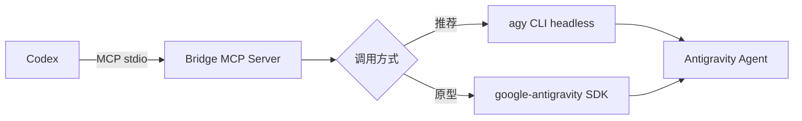

<div align="center">

# Codex <-> Antigravity Bridge

让 OpenAI Codex 通过 MCP 调用 Google Antigravity agent。

一个仓库，两条路径：推荐的 CLI bridge，以及用于深度实验的 Python SDK prototype。

</div>

## 项目定位

这个项目把 Codex 和 Antigravity 连接起来：Codex 负责发起任务，MCP server 负责转发，Antigravity 负责执行 agent 工作流。



## 选择实现

| 实现 | 调用方式 | 适合场景 | 状态 |
| --- | --- | --- | --- |
| [`mcp-antigravity-bridge`](mcp-antigravity-bridge/) | `agy -p` + ConPTY/pty 回退 | 稳定的单轮 Codex 委托 | **推荐** |
| [`mcp-server`](mcp-server/) | `Agent(LocalAgentConfig)` + `Agent.chat` | SDK、模型和多轮能力实验 | 原型 |

推荐从 `mcp-antigravity-bridge` 开始。它不需要在 Python 进程内管理 SDK 生命周期，并针对部分 `agy` 版本的非 TTY 空输出问题提供了自动回退。

## 快速开始

### 1. 安装 Antigravity CLI

Windows PowerShell：

```powershell
irm https://antigravity.google/cli/install.ps1 | iex
```

其他平台请参考 [Antigravity CLI 文档](https://antigravity.google/docs/cli/overview)。

### 2. 安装推荐 bridge

```powershell
cd mcp-antigravity-bridge
python -m pip install -e ".[winpty]"
```

Windows 推荐安装 `pywinpty`，这样 CLI 在普通管道没有输出时可以通过 ConPTY 重试。

### 3. 注册到 Codex

```powershell
codex mcp add codex-agy-bridge -- python -m codex_agy_bridge
```

注册后，可以在 Codex 中直接提出类似请求：

```text
用 agy_ask 让 Antigravity 检查这个仓库的未完成项，并给出修复建议。
```

## MCP 工具

### CLI bridge

| 工具 | 签名 | 说明 |
| --- | --- | --- |
| `agy_ask` | `agy_ask(prompt, workdir="", timeout=300.0)` | 单轮 headless 调用，返回清洗后的文本 |
| `agy_ask_json` | `agy_ask_json(prompt, workdir="", timeout=300.0)` | 请求 `--output-format json`，以文本形式返回结构化 CLI 输出 |

### SDK prototype

| 工具 | 签名 | 说明 |
| --- | --- | --- |
| `run_agy` | `run_agy(prompt, cwd="", api_key="", model="")` | 在 Python 进程内创建 SDK agent 并收集响应 |

## SDK 原型

如果需要直接控制官方 Python SDK，可以使用：

```powershell
cd mcp-server
python -m pip install -e ".[dev]"
```

这个实现使用 `google-antigravity` 的 `LocalAgentConfig` 和 `Agent.chat`，不启动 `agy` CLI。它更适合研究多轮对话、流式响应和工具拦截；详细配置见 [`mcp-server/README.md`](mcp-server/README.md)。

## 手动配置

推荐使用 `codex mcp add`。也可以参考 [`examples/codex-config.toml`](mcp-antigravity-bridge/examples/codex-config.toml)：

```toml
[mcp_servers.codex-agy-bridge]
command = "python"
args = ["-m", "codex_agy_bridge"]
```

## 测试

CLI bridge：

```powershell
cd mcp-antigravity-bridge
python -m pip install -e ".[dev]"
python -m pytest -q
```

SDK prototype：

```powershell
cd mcp-server
python -m pip install -e ".[dev]"
python -m pytest -q
```

测试默认使用 mock，不会自动调用真实模型或消耗 API 配额。

## 常见问题

### 找不到 `agy`

确认 CLI 已安装并且位于 PATH。也可以显式指定：

```powershell
$env:AGY_PATH = "C:\\path\\to\\agy.exe"
```

### 认证失败

先在本地交互运行一次 `agy` 完成登录，再重新启动 MCP server。SDK prototype 则使用 SDK 支持的环境变量、ADC 或 `api_key` 参数。

### CLI 没有输出

bridge 会先尝试普通 subprocess；如果检测到空输出，会自动使用 Windows ConPTY 或 POSIX pty 重试。Windows 建议安装 `pywinpty`。

### 调用超时

为 `agy_ask` 或 `agy_ask_json` 增大 `timeout` 参数，并确认 Antigravity CLI 可以单独完成同一个 prompt。

## 项目结构

```text
.
├── mcp-antigravity-bridge/   # 推荐：CLI + pty 回退
├── mcp-server/               # 原型：Python SDK 直连
├── research/                 # 调研报告与官方文档快照
├── PROGRESS.md               # 项目进度
└── LICENSE                   # Apache-2.0
```

## 参考资料

- [Google Antigravity CLI](https://github.com/google-antigravity/antigravity-cli)
- [Google Antigravity Python SDK](https://github.com/google-antigravity/antigravity-sdk-python)
- [agy-headless-bridge](https://github.com/rhishi99/agy-headless-bridge)
- [agy-bridge](https://github.com/sshahzaiib/agy-bridge)
- [项目调研报告](research/codex-antigravity-cases.md)

## License

Apache-2.0
