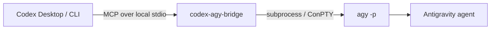

<div align="center">

# Codex <-> Antigravity Bridge

让 Codex 负责规划与验收，让 Google Antigravity `agy` 负责受控实现。

<p>
  <a href="https://www.python.org/"></a>
  <a href="https://modelcontextprotocol.io/"></a>
  <a href="https://github.com/google-antigravity/antigravity-cli"></a>
  <a href="LICENSE"></a>
</p>

<p>
  <strong>Plan with Codex. Implement with agy. Review everything.</strong>
</p>

📘 [English bridge guide](mcp-antigravity-bridge/README.md)

</div>

## 这是什么？

这是一个本地 MCP server，让 Codex 可以在受控范围内调用 Antigravity 的 headless CLI。它不启动、嵌入或控制 Antigravity 桌面 GUI，也不引入 Web server 或数据库。



### 适合什么场景？

- 让 Codex 把一个清晰、可验收的子任务委派给 `agy`。
- 在独立 Git worktree 中异步实现多个互不冲突的页面或模块。
- 保留 Codex 对范围、权限、diff、测试和最终合并的控制权。
- 在 Windows 中文路径、空输出和 PTY 场景下保持更稳定的 CLI 调用。

## 快速开始

### 1. 安装仓库

Windows PowerShell：

```powershell
git clone https://github.com/crazyzhang277/codex-antigravity-bridge.git
cd codex-antigravity-bridge
powershell -ExecutionPolicy Bypass -File .\scripts\install.ps1
```

macOS / Linux：

```bash
git clone https://github.com/crazyzhang277/codex-antigravity-bridge.git
cd codex-antigravity-bridge
sh scripts/install.sh
```

安装脚本会：

1. 以 editable 方式安装本地 bridge。
2. 安装 `agy-supervisor` skill。
3. 幂等注册 `codex-agy-bridge` MCP server。

脚本不会安装或保存 Antigravity OAuth 凭据。

### 2. 安装并登录 `agy`

Windows PowerShell：

```powershell
irm https://antigravity.google/cli/install.ps1 | iex
agy --version
agy
```

按照交互式提示完成登录。macOS / Linux 请参考 [Antigravity CLI 文档](https://antigravity.google/docs/cli/overview)。登录状态由 `agy` 自己管理。

### 3. 验证连接

```powershell
agy -p "Reply exactly AGY_OK"
codex mcp list
```

看到 `AGY_OK`，并在 MCP 列表中看到 `codex-agy-bridge`，就可以在 Codex 中调用 bridge 了。

## 四个 MCP 工具

| 工具 | 用途 | 返回 |
| --- | --- | --- |
| `agy_ask` | 执行一次受控的同步 CLI 任务 | 清理后的文本结果 |
| `agy_ask_json` | 请求结构化 CLI 输出 | JSON 输出文本 |
| `agy_start` | 在独立 worktree 中异步启动任务 | `job_id` |
| `agy_status` | 查询异步任务 | 状态与结果 JSON |

常用调用：

```text
Use agy_ask once. Inspect README.md and return three concrete documentation improvements.
Keep the task read-only, use the repository root as workdir, and do not modify files.
```

参数默认值：

| 参数 | 默认值 | 说明 |
| --- | --- | --- |
| `prompt` | 必填 | 交给 Antigravity 的任务说明 |
| `workdir` | `""` | 空字符串表示继承当前目录 |
| `timeout` | `300.0` | 硬超时时间，单位为秒 |
| `dangerously_skip_permissions` | `false` | 仅在明确授权的可信任务中启用 |

## Supervisor 模式

安装 `agy-supervisor` skill 后，Codex 仍然是监督者，`agy` 只是受控实现者。

- 普通开发请求不会自动调用 `agy`。
- 只有用户明确要求 Antigravity 协作，或明确开启本次 supervisor mode，才会委派。
- Codex 负责任务拆分、文件边界、权限检查、diff 审查和测试验收。
- `agy` 负责一个范围清晰的一次性子任务。
- 每个子任务最多三次调用：首次实现加两次纠正；测试通过、越界、无进展、超时或需要用户决定时停止。

明确授权示例：

```text
开启 supervisor mode。让 Antigravity 在当前项目实现用户设置页。
只允许修改 settings 页面及其专属组件，完成后运行相关测试。
```

## 多页面协同（multi-page）

只有在页面能够独立实现、共享契约已经明确、文件边界互斥且工作区没有并发写入时，才适合使用异步 worktree 协同：

```text
页面 1：dashboard/，只允许修改 dashboard 页面和专属组件
页面 2：settings/，只允许修改 settings 页面和专属组件
页面 3：reports/，只允许修改 reports 页面和专属组件
```

计划会写入 `docs/agy-plans/`。Codex 在自己的 worktree 中继续工作，之后检查 `agy_status`、diff 和测试结果，再决定是否合并。

## 配置与 Windows 支持

推荐使用 Codex CLI 注册：

```powershell
codex mcp add codex-agy-bridge -- python -m codex_agy_bridge
```

手动配置：

```toml
[mcp_servers.codex-agy-bridge]
command = "python"
args = ["-m", "codex_agy_bridge"]
startup_timeout_sec = 120
```

如果 `agy` 不在 `PATH`：

```powershell
$env:AGY_PATH = "C:\path\to\agy.exe"
```

Windows 下建议安装 ConPTY fallback：

```powershell
python -m pip install -e ".\mcp-antigravity-bridge[winpty]"
```

把真实项目目录传给工具的 `workdir`，不要把机器专属路径硬编码进 MCP 配置。bridge 会处理非 ASCII 工作目录；如果直接 stdout 为空，会尝试 ConPTY。

## 安全边界

- 通信只经过本地 MCP stdio。
- `dangerously_skip_permissions` 默认关闭。
- 不自动委托生产操作、不可逆操作、跨项目写入或范围不明的任务。
- 不把 OAuth 材料、密钥、代理凭据或私有 Codex 配置传给 `agy`。
- `agy` 修改了禁止文件、输出为空、超时或要求人工决定时，监督流程会停止并报告，而不是无限重试。

## 验证

bridge 单元测试不会要求真实 Antigravity 登录：

```powershell
cd mcp-antigravity-bridge
python -m pytest -q
python -m compileall -q src
```

仓库级 skill 和分发检查：

```powershell
cd ..
python -m pytest -q
python scripts/validate_skill.py
git diff --check
```

## 项目结构

```text
.
├── mcp-antigravity-bridge/       # 本地 MCP runtime
├── skills/agy-supervisor/        # Codex supervisor skill
├── scripts/                      # 安装与验证脚本
├── tests/                        # skill 与分发回归测试
├── docs/superpowers/             # 设计与执行记录
├── research/                     # 研究资料与历史比较
├── PROGRESS.md
├── LICENSE
└── README.md
```

## 文档导航

- [Bridge English technical guide](mcp-antigravity-bridge/README.md)
- [Supervisor skill](skills/agy-supervisor/SKILL.md)
- [验证脚本](scripts/validate_skill.py)
- [项目进度](PROGRESS.md)

## 参考资料

- [Antigravity CLI](https://github.com/google-antigravity/antigravity-cli)
- [Antigravity CLI 文档](https://antigravity.google/docs/cli/overview)
- [Model Context Protocol](https://modelcontextprotocol.io/)

## License

Apache-2.0
