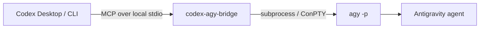
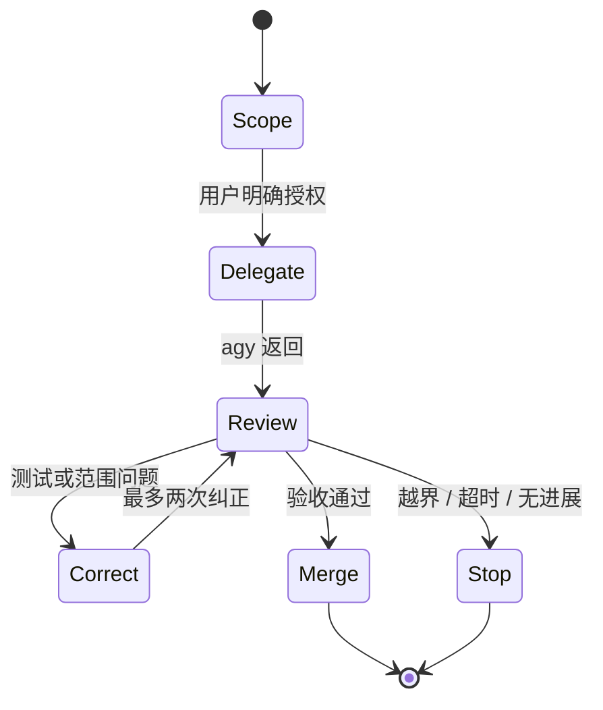

<div align="center">

# Codex <sup>×</sup> Antigravity

### 一个把 Codex 的判断力与 `agy` 的执行力接起来的本地 MCP bridge

<p>
  <a href="https://github.com/crazyzhang277/codex-antigravity-bridge"></a>
  <a href="https://www.python.org/"></a>
  <a href="https://modelcontextprotocol.io/"></a>
  <a href="https://github.com/google-antigravity/antigravity-cli"></a>
</p>

<p><strong>Plan with Codex · Implement with agy · Review everything</strong></p>

<p>
  <a href="#快速开始">快速开始</a> ·
  <a href="#四个工具">工具</a> ·
  <a href="#supervisor-模式">Supervisor 模式</a> ·
  <a href="mcp-antigravity-bridge/README.md">English 技术文档</a>
</p>

</div>

> [!IMPORTANT]
> **CLI-only。** 本项目只调用 Antigravity 的 headless CLI，不启动、嵌入或控制 Antigravity 桌面 GUI。

## 一眼看懂

| Codex | Bridge | Antigravity |
| :---: | :---: | :---: |
| 规划 · 拆分 · 验收 | MCP · 权限边界 · worktree | 实现 · 测试 · 返回结果 |



这个项目的核心取舍很简单：**让 Codex 保持监督权，让 `agy` 只做清晰、可回滚、可验收的子任务。**

## 为什么值得用

<table>
<tr>
<td width="25%"><strong>原生接入</strong><br><sub>注册为 MCP server，Codex Desktop 和 Codex CLI 都能直接调用。</sub></td>
<td width="25%"><strong>CLI-first</strong><br><sub>复用 `agy` 自己的登录、工作区和权限流程。</sub></td>
<td width="25%"><strong>Windows 友好</strong><br><sub>支持中文路径，并在空输出时尝试 ConPTY fallback。</sub></td>
<td width="25%"><strong>小而清楚</strong><br><sub>本地 stdio、四个工具，没有 Web server 和数据库。</sub></td>
</tr>
</table>

## 快速开始

### 01 · 安装仓库

**Windows PowerShell**

```powershell
git clone https://github.com/crazyzhang277/codex-antigravity-bridge.git
cd codex-antigravity-bridge
powershell -ExecutionPolicy Bypass -File .\scripts\install.ps1
```

**macOS / Linux**

```bash
git clone https://github.com/crazyzhang277/codex-antigravity-bridge.git
cd codex-antigravity-bridge
sh scripts/install.sh
```

安装脚本会安装 bridge、复制 `agy-supervisor` skill，并幂等注册 `codex-agy-bridge`。它不会安装或保存 Antigravity OAuth 凭据。

### 02 · 安装并登录 `agy`

Windows PowerShell：

```powershell
irm https://antigravity.google/cli/install.ps1 | iex
agy --version
agy
```

按照交互式提示完成登录。macOS / Linux 请参考 [Antigravity CLI 文档](https://antigravity.google/docs/cli/overview)。

### 03 · 验证连接

```powershell
agy -p "Reply exactly AGY_OK"
codex mcp list
```

看到 `AGY_OK`，并在 MCP 列表中看到 `codex-agy-bridge`，就可以在 Codex 中使用它。

## 四个工具

| 工具 | 作用 | 返回 |
| --- | --- | --- |
| `agy_ask` | 同步执行一次受控 CLI 任务 | 清理后的文本 |
| `agy_ask_json` | 请求结构化 CLI 输出，并拒绝非法 JSON | JSON 输出文本 |
| `agy_start` | 在调用方提供的独立 worktree 中异步启动任务 | `job_id` |
| `agy_status` | 查询异步任务 | 状态与结果 JSON |

常用的只读请求：

```text
Use agy_ask once. Inspect README.md and return three concrete improvements.
Keep the task read-only, use the repository root as workdir, and do not modify files.
```

| 参数 | 默认值 | 说明 |
| --- | --- | --- |
| `prompt` | 必填 | 交给 Antigravity 的任务说明 |
| `workdir` | `""` | 空字符串表示继承当前目录 |
| `timeout` | `300.0` | 硬超时时间，单位为秒 |
| `dangerously_skip_permissions` | `false` | 仅在明确授权的可信任务中启用 |

## Supervisor 模式

安装 `agy-supervisor` skill 后，Codex 仍然是监督者，`agy` 只是受控实现者。



- 普通开发请求不会自动调用 `agy`。
- 只有用户明确要求 Antigravity 协作，或明确开启本次 supervisor mode，才会委派。
- Codex 负责拆分任务、文件边界、权限检查、diff 审查和测试验收。
- 每个子任务最多三次调用：首次实现加两次纠正。
- 测试通过、越界、无进展、超时或需要用户决定时立即停止。

明确授权示例：

```text
开启 supervisor mode。让 Antigravity 在当前项目实现用户设置页。
只允许修改 settings 页面及其专属组件，完成后运行相关测试。
```

## 多页面协同（multi-page）

适合异步 worktree 协同的任务必须满足：页面可独立实现、共享契约明确、文件边界互斥，并且没有其他进程同时修改相关文件。

```text
页面 1：dashboard/，只允许修改 dashboard 页面和专属组件
页面 2：settings/，只允许修改 settings 页面和专属组件
页面 3：reports/，只允许修改 reports 页面和专属组件
```

Codex 会先把计划写入 `docs/agy-plans/`，创建并验证独立 AGY worktree，再把该目录作为 `workdir` 传给 `agy_start`。bridge 不会自动创建 Git worktree，也不会替代 supervisor 做边界审计。任务结束后检查 `agy_status`、diff 和测试结果，再决定是否合并。

## 配置与 Windows 支持

推荐使用 Codex CLI 注册：

```powershell
codex mcp add codex-agy-bridge -- python -m codex_agy_bridge
```

<details>
<summary>手动 MCP 配置</summary>

```toml
[mcp_servers.codex-agy-bridge]
command = "python"
args = ["-m", "codex_agy_bridge"]
startup_timeout_sec = 120
```

</details>

<details>
<summary>Windows 路径与 ConPTY</summary>

如果 `agy` 不在 `PATH`：

```powershell
$env:AGY_PATH = "C:\path\to\agy.exe"
```

建议安装 Windows fallback：

```powershell
python -m pip install -e ".\mcp-antigravity-bridge[winpty]"
```

把真实项目目录传给工具的 `workdir`，不要把机器专属路径硬编码进 MCP 配置。

</details>

## 安全边界

- 通信只经过本地 MCP stdio。
- `dangerously_skip_permissions` 默认关闭。
- 不自动委托生产操作、不可逆操作、跨项目写入或范围不明的任务。
- 不把 OAuth 材料、密钥、代理凭据或私有 Codex 配置传给 `agy`。
- `agy` 修改了禁止文件、输出为空或超时时，监督流程会停止并报告，不会无限重试。

## 验证

```powershell
# bridge tests
cd mcp-antigravity-bridge
python -m pytest -q
python -m compileall -q src

# repository checks
cd ..
python -m pytest -q
python scripts/validate_skill.py
git diff --check
```

单元测试会 mock 进程边界，不要求真实 Antigravity 登录。

## 项目结构

```text
.
├── mcp-antigravity-bridge/       # 本地 MCP runtime
├── skills/agy-supervisor/        # Codex supervisor skill
├── scripts/                      # 安装与验证脚本
├── tests/                        # skill 与分发回归测试
├── docs/superpowers/             # 设计与执行记录
├── research/                     # 研究资料与历史比较
├── PROGRESS.md
├── LICENSE
└── README.md
```

## 继续阅读

| 想了解 | 从这里开始 |
| --- | --- |
| 安装、API、运行机制和排错 | [Bridge English technical guide](mcp-antigravity-bridge/README.md) |
| 委派规则和验收协议 | [Supervisor skill](skills/agy-supervisor/SKILL.md) |
| 分发与 skill 验证 | [validate_skill.py](scripts/validate_skill.py) |
| 项目进度 | [PROGRESS.md](PROGRESS.md) |

## 参考资料

- [Antigravity CLI](https://github.com/google-antigravity/antigravity-cli)
- [Antigravity CLI 文档](https://antigravity.google/docs/cli/overview)
- [Model Context Protocol](https://modelcontextprotocol.io/)

## License

Apache-2.0
