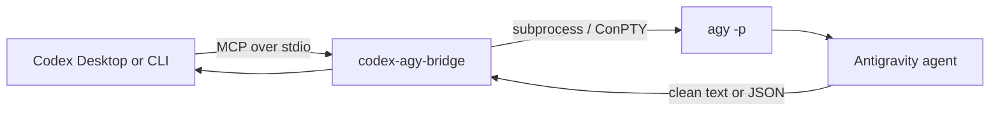

<div align="center">

# Codex &lt;-&gt; Antigravity Bridge

Give Codex Desktop a local MCP tool that delegates work to Google's Antigravity CLI.

<p>
  <a href="https://www.python.org/"></a>
  <a href="https://modelcontextprotocol.io/"></a>
  <a href="https://github.com/google-antigravity/antigravity-cli"></a>
  <a href="LICENSE"></a>
</p>

</div>

## What It Does

This project gives Codex a local MCP server that starts `agy -p` as a headless child process and returns the result to Codex.



The supported integration is **Codex -> MCP -> `agy` CLI**. It does not embed, launch, or control the Antigravity desktop GUI.

## Why This Bridge

- **Native Codex integration:** register it as an MCP server and call it from Codex Desktop or Codex CLI.
- **CLI-first:** reuse Antigravity's own login, workspace, and permissions flow through `agy`.
- **Windows-aware:** handle non-ASCII workdirs and retry through ConPTY when direct output is empty.
- **Small surface area:** two tools, local stdio transport, no web server, no database, no SDK runtime.

## Quick Start

### 1. Install Antigravity CLI

On Windows PowerShell:

```powershell
irm https://antigravity.google/cli/install.ps1 | iex
agy --version
```

Complete the interactive `agy` login once before using headless calls.

### 2. Install the bridge

From this repository:

```powershell
cd mcp-antigravity-bridge
python -m pip install -e ".[dev,winpty]"
```

On macOS or Linux, `python -m pip install -e ".[dev]"` is enough.

### 3. Register it with Codex

```powershell
codex mcp add codex-agy-bridge -- python -m codex_agy_bridge
```

After registration, ask Codex to use the `agy_ask` tool for a bounded task. The bridge is started automatically over local MCP stdio; no separate web server is required.

## Tools

| Tool | Signature | Use it for |
| --- | --- | --- |
| `agy_ask` | `agy_ask(prompt, workdir="", timeout=300.0, dangerously_skip_permissions=false)` | Normal text responses from a single headless Antigravity task. |
| `agy_ask_json` | `agy_ask_json(prompt, workdir="", timeout=300.0, dangerously_skip_permissions=false)` | Structured CLI output using `--output-format json`. |

Example request inside Codex:

```text
Use agy_ask once. Ask Antigravity to inspect README.md and return three concrete documentation improvements. Use the repository root as workdir and keep the task read-only.
```

The bridge turns a normal request into a command equivalent to:

```text
agy -p "your prompt"
```

When `dangerously_skip_permissions=true` is explicitly requested, it adds:

```text
--dangerously-skip-permissions
```

Use that flag only for trusted prompts and trusted work directories.

## Manual Configuration

The recommended setup is `codex mcp add`. For a checked-in or machine-specific Codex configuration, use:

```toml
[mcp_servers.codex-agy-bridge]
command = "python"
args = ["-m", "codex_agy_bridge"]
startup_timeout_sec = 120
```

If `agy` is not on `PATH`, point the bridge at the binary explicitly:

```powershell
$env:AGY_PATH = "C:\path\to\agy.exe"
```

For a Python installation that is not on the desktop app's `PATH`, use its absolute path in `command`.

## How It Works

The runtime lives in `mcp-antigravity-bridge/src/codex_agy_bridge/`:

1. `server.py` registers `agy_ask` and `agy_ask_json` with FastMCP.
2. `agy_runner.py` locates `agy`, builds the CLI arguments, and starts the process.
3. On Windows, non-ASCII workdirs are converted to an ASCII short path when available.
4. If direct stdout is empty, the runner retries through Windows ConPTY or POSIX pty.
5. ANSI and TUI decoration are removed before the result is returned to Codex.

## Windows Notes

- Install the optional `winpty` extra for the ConPTY fallback: `python -m pip install -e ".[winpty]"`.
- Keep the Codex MCP command itself on an ASCII path when possible.
- Pass the real project directory through the tool's `workdir`; the runner handles the Windows path conversion.
- If `agy` works in an interactive terminal but not through Codex, check `AGY_PATH`, inherited environment variables, and the CLI login state.

## Security Boundary

- The bridge communicates with Codex over local stdio MCP.
- `dangerously_skip_permissions` defaults to `false`.
- Headless permission bypass should be limited to prompts, workdirs, and file operations you trust.
- Do not commit Antigravity OAuth material, proxy credentials, or private Codex configuration.

## Verification

Run the bridge tests from its directory:

```powershell
cd mcp-antigravity-bridge
python -m pytest -q
python -m compileall -q src
```

The unit tests mock the process boundary, so they do not require a live Antigravity login. For a layered real-machine check, verify in order:

```powershell
agy -p "Reply exactly DIRECT_AGY_OK" --dangerously-skip-permissions
codex mcp list
```

Then call `agy_ask` from Codex Desktop with a small, reversible task.

## Project Structure

```text
.
├── mcp-antigravity-bridge/
│   ├── src/codex_agy_bridge/
│   │   ├── agy_runner.py
│   │   ├── server.py
│   │   └── __main__.py
│   ├── tests/test_smoke.py
│   ├── examples/codex-config.toml
│   └── pyproject.toml
├── research/
├── docs/superpowers/
├── PROGRESS.md
├── LICENSE
└── README.md
```

`research/` contains source notes and historical comparisons. The supported runtime is the CLI bridge above.

## References

- [Antigravity CLI](https://github.com/google-antigravity/antigravity-cli)
- [Antigravity CLI documentation](https://antigravity.google/docs/cli/overview)
- [Model Context Protocol](https://modelcontextprotocol.io/)
- [agy-headless-bridge](https://github.com/rhishi99/agy-headless-bridge)
- [agy-bridge](https://github.com/sshahzaiib/agy-bridge)

## License

Apache-2.0
