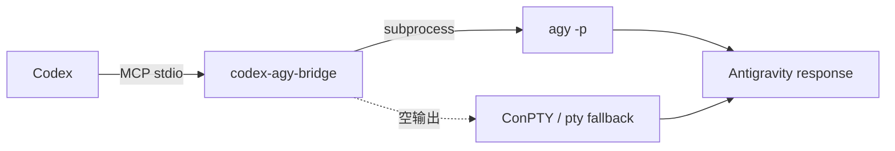

# codex-agy-bridge

推荐的 Codex -> Antigravity MCP bridge。它通过 `agy -p` 调用 Google Antigravity CLI，并在普通 subprocess 没有输出时自动回退到伪终端。

## 为什么需要这个 bridge

Antigravity CLI 的交互模式是 TUI，而 Codex 需要通过 MCP 使用一个稳定的 stdio server。部分 CLI 构建版本在 stdout 不是 TTY 时可能返回空输出；本项目会按以下顺序处理：

1. 普通 subprocess 调用。
2. Windows 使用 ConPTY 重试，依赖 `pywinpty`。
3. macOS/Linux 使用标准库 `pty` 重试。
4. 清理 ANSI 控制字符和 TUI 装饰后返回文本。



## 安装

### 1. 安装 Antigravity CLI

Windows PowerShell：

```powershell
irm https://antigravity.google/cli/install.ps1 | iex
```

其他平台请参考 [CLI 文档](https://antigravity.google/docs/cli/overview)。

### 2. 安装 bridge

```powershell
cd mcp-antigravity-bridge
python -m pip install -e ".[winpty]"
```

开发测试依赖：

```powershell
python -m pip install -e ".[dev]"
```

## 接入 Codex

推荐使用命令注册：

```powershell
codex mcp add codex-agy-bridge -- python -m codex_agy_bridge
```

也可以手动添加到 Codex 配置：

```toml
[mcp_servers.codex-agy-bridge]
command = "python"
args = ["-m", "codex_agy_bridge"]
```

注册后，Codex 可以调用 `agy_ask` 或 `agy_ask_json`。

## 工具

### `agy_ask`

```text
agy_ask(prompt: str, workdir: str = "", timeout: float = 300.0) -> str
```

适合普通文本回答。`workdir` 为空时继承 MCP server 的当前目录。

### `agy_ask_json`

```text
agy_ask_json(prompt: str, workdir: str = "", timeout: float = 300.0) -> str
```

会向 CLI 追加 `--output-format json`，并以文本形式返回结构化输出。需要在 prompt 中明确要求模型返回的内容结构。

## 配置

### `AGY_PATH`

显式指定 CLI 可执行文件路径：

```powershell
$env:AGY_PATH = "C:\\path\\to\\agy.exe"
```

如果未设置，bridge 会依次检查 PATH 和常见的本地安装目录。

### `pywinpty`

`pywinpty` 是 Windows ConPTY 回退依赖。它不是普通调用的硬依赖，但 Windows 环境建议安装，以应对 CLI 非 TTY 空输出。

## 常见问题

### `agy binary not found`

确认 CLI 已安装，或设置 `AGY_PATH`。可以先直接运行：

```powershell
agy --version
```

### 认证失败

先在终端交互运行一次 `agy` 完成登录，然后重新调用 MCP 工具。认证状态由 CLI 管理，bridge 不保存账号凭据。

### 返回空文本

Windows 安装 `pywinpty` 后重试。bridge 会自动切换到 ConPTY；如果仍然为空，先确认同一个 prompt 能在 CLI 中单独完成。

### 超时

增大工具的 `timeout` 参数，或减少 prompt 的工作范围。超时是整个 CLI 调用的墙钟时间限制。

## 测试

```powershell
python -m pytest -q
```

测试不要求本机已经安装或登录 `agy`，只覆盖输出清理和二进制发现逻辑。

## 文件结构

```text
src/codex_agy_bridge/
├── agy_runner.py    # subprocess、ConPTY/pty 回退、ANSI 清理
├── server.py        # FastMCP 工具注册
└── __main__.py      # python -m codex_agy_bridge 入口
```

## 参考

- [Antigravity CLI](https://github.com/google-antigravity/antigravity-cli)
- [agy-headless-bridge](https://github.com/rhishi99/agy-headless-bridge)
- [agy-bridge](https://github.com/sshahzaiib/agy-bridge)

## License

Apache-2.0
