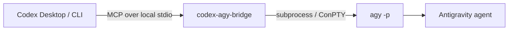

<div align="center">

# codex-agy-bridge

### A local MCP bridge between Codex and Google's headless Antigravity CLI

<p>
  <a href="https://github.com/crazyzhang277/codex-antigravity-bridge"></a>
  <a href="https://www.python.org/"></a>
  <a href="https://modelcontextprotocol.io/"></a>
  <a href="https://github.com/google-antigravity/antigravity-cli"></a>
</p>

<p><strong>Scope clearly · Delegate safely · Review the diff</strong></p>

<p>
  <a href="#quick-start">Quick Start</a> ·
  <a href="#tool-api">Tool API</a> ·
  <a href="#parallel-worktree-workflow">Worktrees</a> ·
  <a href="../README.md">Chinese project overview</a>
</p>

</div>

> [!IMPORTANT]
> **CLI-only.** This project invokes Antigravity's headless `agy` CLI. It does not launch, embed, or control the Antigravity desktop GUI.

## 🧭 At A Glance

| Codex | Bridge | Antigravity |
| :---: | :---: | :---: |
| Plan · Split · Review | MCP · permissions · worktrees | Implement · Test · Report |



The bridge exposes four local MCP tools. Synchronous tools run a bounded `agy -p` call and return cleaned output. Asynchronous tools start explicit jobs in a caller-provided workdir so Codex can continue working; the caller is responsible for creating and validating an isolated Git worktree.

## ✨ Why This Bridge

<table>
<tr>
<td width="25%"><strong>Native MCP</strong><br><sub>Use it from Codex Desktop or Codex CLI without a separate web service.</sub></td>
<td width="25%"><strong>CLI-first</strong><br><sub>Reuse `agy` login, workspace, and permission behavior.</sub></td>
<td width="25%"><strong>Windows-aware</strong><br><sub>Handle non-ASCII workdirs and retry empty output through ConPTY.</sub></td>
<td width="25%"><strong>Small surface</strong><br><sub>Local stdio, four tools, no database or SDK runtime.</sub></td>
</tr>
</table>

## 🚀 Quick Start

### 01 · 📋 Prerequisites

- Python 3.10 or newer.
- Antigravity CLI installed as `agy`.
- One completed interactive `agy` login.
- Codex Desktop or Codex CLI with MCP support.

On Windows PowerShell:

```powershell
irm https://antigravity.google/cli/install.ps1 | iex
agy --version
agy
```

On macOS or Linux, follow the [Antigravity CLI documentation](https://antigravity.google/docs/cli/overview), then run `agy` once to complete login.

### 02 · 📦 Install the bridge

From this directory:

```powershell
python -m pip install -e ".[dev,winpty]"
```

On macOS or Linux:

```bash
python -m pip install -e ".[dev]"
```

The `dev` extra installs pytest. The `winpty` extra enables the Windows ConPTY fallback. The package does not install or manage Antigravity OAuth credentials.

### 🌐 Per-user Proxy Configuration

Proxy ports are application-specific. Run the repository-level installer from the repository root. It detects environment and system proxy settings plus common local proxy listeners, then writes the result to the current user's Codex MCP configuration. For a proxy that cannot be detected automatically, pass its address explicitly:

```powershell
powershell -ExecutionPolicy Bypass -File .\scripts\install.ps1 -ProxyUrl "http://127.0.0.1:7897"
```

On macOS or Linux, set `PROXY_URL` before running `scripts/install.sh`. The proxy is passed to the MCP child process through `HTTP_PROXY`, `HTTPS_PROXY`, and `ALL_PROXY`; no TUN mode is required when the local proxy accepts HTTP CONNECT or SOCKS5.

### 03 · Register with Codex

```powershell
codex mcp add codex-agy-bridge -- python -m codex_agy_bridge
codex mcp list
```

The bridge starts automatically over local MCP stdio. No separate HTTP server is required.

<details>
<summary>Manual MCP configuration</summary>

```toml
[mcp_servers.codex-agy-bridge]
command = "python"
args = ["-m", "codex_agy_bridge"]
startup_timeout_sec = 120

[mcp_servers.codex-agy-bridge.env]
HTTP_PROXY = "http://127.0.0.1:7897"
HTTPS_PROXY = "http://127.0.0.1:7897"
ALL_PROXY = "http://127.0.0.1:7897"
NO_PROXY = "localhost,127.0.0.1"
```

</details>

## 🧰 Tool API

| Tool | Best for | Result |
| --- | --- | --- |
| `agy_ask` | A bounded synchronous task | Cleaned text |
| `agy_ask_json` | Structured CLI output | JSON text |
| `agy_start` | Explicit work in a caller-created worktree | `job_id` |
| `agy_status` | Polling an async job | Status and result JSON |

### `agy_ask`

```text
agy_ask(
  prompt: str,
  workdir: str = "",
  timeout: float = 300.0,
  dangerously_skip_permissions: bool = False,
) -> str
```

Use it for bounded tasks such as inspecting files, explaining code, or proposing documentation changes.

### `agy_ask_json`

```text
agy_ask_json(
  prompt: str,
  workdir: str = "",
  timeout: float = 300.0,
  dangerously_skip_permissions: bool = False,
) -> str
```

Use it when the prompt requires structured output. The bridge adds `--output-format json` internally, rejects unparseable output, and returns valid JSON text. The requested schema remains part of the prompt contract and must be checked by the supervisor.

### `agy_start` and `agy_status`

Use `agy_start` only with an explicit existing `workdir` pointing to a caller-created isolated worktree. The bridge does not create Git worktrees. Poll the returned job id with `agy_status`.

| State | Meaning |
| --- | --- |
| `queued` | Accepted and waiting to run |
| `running` | Antigravity process is active |
| `completed` | Process finished successfully |
| `failed` | Process finished with an error |
| `unknown` | Job is unavailable in this bridge process |

### Shared parameters

| Parameter | Default | Meaning |
| --- | --- | --- |
| `prompt` | required | Task instruction sent to Antigravity |
| `workdir` | `""` | Working directory; empty means inherited directory |
| `timeout` | `300.0` | Hard wall-clock limit in seconds |
| `dangerously_skip_permissions` | `false` | Adds the bypass flag when explicitly enabled |

Safe read-only example:

```text
Use agy_ask once. Inspect README.md and return three concrete improvements.
Keep the task read-only, use the repository root as workdir, and do not modify files.
```

## 🧩 Parallel Worktree Workflow

Use asynchronous work only for independent, well-bounded tasks.

Before calling `agy_start`, Codex should:

1. Define shared routes, components, state, and data contracts.
2. Write a plan under `docs/agy-plans/`.
3. Assign exclusive file boundaries and acceptance checks.
4. Create the AGY worktree.
5. Keep other processes away from the same files.

Each delegated task has at most three AGY calls: one initial implementation and at most two corrections. Stop when tests pass, the task exceeds its boundary, progress stops, the process times out, or a user decision is required.

Codex remains responsible for reviewing the diff, checking worktree state, running tests, and deciding whether to merge.

## ⚙️ Runtime Behavior

The runtime lives in `src/codex_agy_bridge/`:

1. `server.py` registers the four MCP tools with FastMCP.
2. `agy_runner.py` discovers the CLI through `AGY_PATH`, `PATH`, and platform defaults.
3. The runner builds `agy -p <prompt>` and optionally adds JSON output or the permission bypass.
4. Windows non-ASCII workdirs are converted to an ASCII short path when available.
5. Direct subprocess execution is attempted first; empty stdout triggers a ConPTY or POSIX `pty` retry.
6. ANSI escapes, carriage-return repainting, and TUI decoration are removed.
7. Nonzero exits, stderr, PTY failures, and empty-output failures are preserved as actionable diagnostics.
8. `agy_jobs.py` manages explicit asynchronous jobs in a bounded thread pool.
9. Completed jobs are retained for a finite period and the worker pool has an explicit shutdown path.

## 🔧 Configuration

If `agy` is not on `PATH`, set `AGY_PATH`:

```powershell
$env:AGY_PATH = "C:\path\to\agy.exe"
```

If Codex Desktop cannot find Python, use Python's absolute path in the MCP configuration. Keep the launch command on an ASCII path when possible, but pass the actual project directory through `workdir`.

## 🔒 Security Boundary

- Communication stays on local MCP stdio.
- `dangerously_skip_permissions` defaults to `false`.
- Use the bypass only for trusted prompts, trusted workdirs, and reversible actions.
- Never commit OAuth material, proxy credentials, or private Codex configuration.
- Do not delegate production operations, irreversible actions, cross-project writes, or unclear tasks.

## ✅ Verification

Run from this directory:

```powershell
python -m pytest -q
python -m compileall -q src
```

The unit tests mock the process boundary and do not require a live Antigravity login.

For a layered real-machine check:

```powershell
agy -p "Reply exactly DIRECT_AGY_OK" --dangerously-skip-permissions
codex mcp list
```

Then call `agy_ask` from Codex with a small, reversible task.

## 🩺 Troubleshooting

<details>
<summary><code>agy</code> binary not found</summary>

Run `agy --version`. Install the CLI or set `AGY_PATH` to the full executable path.

</details>

<details>
<summary>Authentication required</summary>

Run `agy` interactively once and complete CLI login. The bridge does not store or manage OAuth credentials.

</details>

<details>
<summary>Proxy works only with TUN mode</summary>

TUN mode is not required when the proxy exposes a local HTTP CONNECT or SOCKS5 port. Run the repository installer to detect common ports, or pass the exact address with `-ProxyUrl`. The installer writes proxy variables only to the current user's `codex-agy-bridge` MCP configuration.

```powershell
powershell -ExecutionPolicy Bypass -File .\scripts\install.ps1 -ProxyUrl "http://127.0.0.1:7897"
```

</details>

<details>
<summary>Empty output from a headless call</summary>

Install the `winpty` extra on Windows. The runner retries through ConPTY on Windows or `pty` on POSIX when direct stdout is empty.

</details>

<details>
<summary>Async job is <code>unknown</code></summary>

Job state is kept in memory by one bridge process. If the MCP process restarted, the old job id is unavailable. Start again only after Codex has reviewed the existing worktree.

</details>

## 🗂️ Project Structure

```text
mcp-antigravity-bridge/
├── src/codex_agy_bridge/
│   ├── agy_runner.py    # CLI discovery, subprocess, PTY fallback, output cleanup
│   ├── agy_jobs.py      # asynchronous job registry
│   ├── server.py        # FastMCP tool registration
│   └── __main__.py      # python -m codex_agy_bridge entry point
├── tests/
│   ├── test_smoke.py
│   ├── test_mcp_stdio.py
│   └── test_async_jobs.py
├── examples/
│   └── codex-config.toml
├── pyproject.toml
└── README.md
```

## 🔗 References

- [Antigravity CLI](https://github.com/google-antigravity/antigravity-cli)
- [Antigravity CLI documentation](https://antigravity.google/docs/cli/overview)
- [Model Context Protocol](https://modelcontextprotocol.io/)
- [agy-headless-bridge](https://github.com/rhishi99/agy-headless-bridge)
- [agy-bridge](https://github.com/sshahzaiib/agy-bridge)

## 📄 License

Apache-2.0
