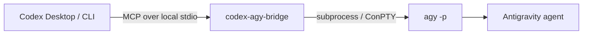

<div align="center">

# codex-agy-bridge

An MCP server that lets Codex call Google's Antigravity `agy` CLI headlessly.

<p>
  <a href="https://www.python.org/"></a>
  <a href="https://modelcontextprotocol.io/"></a>
  <a href="https://github.com/google-antigravity/antigravity-cli"></a>
  <a href="../LICENSE"></a>
</p>

🇨🇳 [简体中文项目首页](../README.md)

</div>

## Overview

`codex-agy-bridge` exposes four local MCP tools for bounded Antigravity CLI work. Synchronous tools run `agy -p` and return cleaned output. Asynchronous tools start a job in a separate Git worktree so Codex can keep working while the task runs.



The supported integration is CLI-only. This project does **not** launch, embed, or control the Antigravity desktop GUI.

### Design goals

- **Native integration:** use the bridge from Codex Desktop or Codex CLI through MCP.
- **CLI-first:** reuse `agy`'s own login, workspace, and permission flow.
- **Windows-aware:** support non-ASCII workdirs and retry through ConPTY when direct output is empty.
- **Small surface:** local stdio transport, four tools, no web server, database, or SDK runtime.

## Quick Start

### Prerequisites

- Python 3.10 or newer.
- Antigravity CLI installed and available as `agy`.
- An interactive `agy` login completed before the first headless call.
- Codex Desktop or Codex CLI with MCP support.

On Windows PowerShell:

```powershell
irm https://antigravity.google/cli/install.ps1 | iex
agy --version
agy
```

On macOS or Linux, follow the [Antigravity CLI documentation](https://antigravity.google/docs/cli/overview) and run `agy` once to complete login.

### Install the bridge

From this directory:

```powershell
python -m pip install -e ".[dev,winpty]"
```

On macOS or Linux:

```bash
python -m pip install -e ".[dev]"
```

The `dev` extra installs pytest. The `winpty` extra enables the Windows ConPTY fallback. The package does not install or manage Antigravity OAuth credentials.

### Register with Codex

```powershell
codex mcp add codex-agy-bridge -- python -m codex_agy_bridge
codex mcp list
```

The bridge starts automatically over local MCP stdio. No separate HTTP server is required.

For a checked-in or machine-specific configuration:

```toml
[mcp_servers.codex-agy-bridge]
command = "python"
args = ["-m", "codex_agy_bridge"]
startup_timeout_sec = 120
```

## Tool API

### `agy_ask`

```text
agy_ask(
  prompt: str,
  workdir: str = "",
  timeout: float = 300.0,
  dangerously_skip_permissions: bool = False,
) -> str
```

Use it for a normal, bounded task such as inspecting files, explaining code, or proposing documentation changes.

### `agy_ask_json`

```text
agy_ask_json(
  prompt: str,
  workdir: str = "",
  timeout: float = 300.0,
  dangerously_skip_permissions: bool = False,
) -> str
```

Use it when the prompt requires structured output. Internally, the bridge adds `--output-format json`; the public tool still returns the result as text.

### `agy_start` and `agy_status`

Use `agy_start` only for explicit parallel worktree collaboration. It returns a job id immediately. Poll that id with `agy_status` while Codex works in another worktree.

Async status is JSON text with one of these states:

| State | Meaning |
| --- | --- |
| `queued` | Job accepted and waiting to run |
| `running` | Antigravity process is active |
| `completed` | Process finished successfully |
| `failed` | Process finished with an error |
| `unknown` | Job is not available in the current bridge process |

### Shared parameters

| Parameter | Default | Meaning |
| --- | --- | --- |
| `prompt` | required | Task instruction sent to Antigravity |
| `workdir` | `""` | Working directory; empty means the inherited directory |
| `timeout` | `300.0` | Hard wall-clock limit in seconds |
| `dangerously_skip_permissions` | `false` | Adds the permission bypass flag when explicitly enabled |

Example of a safe read-only request:

```text
Use agy_ask once. Inspect README.md and return three concrete improvements.
Keep the task read-only, use the repository root as workdir, and do not modify files.
```

## Parallel Worktree Workflow

The asynchronous tools are intended for independent, well-bounded work. Before calling `agy_start`, Codex should establish shared contracts, write a plan under `docs/agy-plans/`, assign exclusive file boundaries, and create the AGY worktree.

Use this pattern only when:

- at least two areas can be implemented independently;
- shared routes, components, state, and data contracts are explicit;
- each task has an exclusive file boundary and acceptance checks;
- no other process is editing the same files.

Each delegated task has at most three AGY calls: one initial implementation and at most two corrections. Stop immediately when tests pass, the task exceeds its boundary, progress stops, the process times out, or a user decision is required.

Codex remains responsible for reviewing the diff, running tests, checking worktree state, and deciding whether to merge the result.

## Runtime Behavior

The runtime lives in `src/codex_agy_bridge/`:

1. `server.py` registers the four MCP tools with FastMCP.
2. `agy_runner.py` discovers the CLI through `AGY_PATH`, `PATH`, and platform defaults.
3. The runner builds `agy -p <prompt>` and optionally adds JSON output or the permission bypass.
4. On Windows, non-ASCII workdirs are converted to an ASCII short path when available.
5. Direct subprocess execution is attempted first. Empty stdout triggers a Windows ConPTY or POSIX `pty` retry.
6. ANSI escapes, carriage-return repainting, and TUI decoration are removed before returning text.
7. `agy_jobs.py` manages explicit asynchronous jobs in a bounded thread pool.

The public tools return cleaned text. The internal runner also tracks the exit code and whether a PTY was used.

## Configuration

If `agy` is not on `PATH`, set `AGY_PATH` to the full executable path:

```powershell
$env:AGY_PATH = "C:\path\to\agy.exe"
```

If Codex Desktop cannot find Python, replace `command` in the MCP configuration with Python's absolute path. Keep the MCP launch command on an ASCII path when possible, but pass the actual project directory through `workdir`.

## Security Boundary

- The bridge communicates with its MCP client over local stdio.
- `dangerously_skip_permissions` defaults to `false`.
- Enabling the bypass removes interactive permission prompts. Use it only for trusted prompts, trusted workdirs, and reversible actions.
- Never commit Antigravity OAuth material, proxy credentials, or private Codex configuration.
- Do not delegate production operations, irreversible actions, cross-project writes, or tasks with unclear boundaries.

## Verification

Run the local checks from this directory:

```powershell
python -m pytest -q
python -m compileall -q src
```

The unit tests mock the process boundary and do not require a live Antigravity login. For a layered real-machine check:

```powershell
agy -p "Reply exactly DIRECT_AGY_OK" --dangerously-skip-permissions
codex mcp list
```

Then call `agy_ask` from Codex with a small, reversible task.

## Troubleshooting

### `agy binary not found`

Run `agy --version`. Install the CLI or set `AGY_PATH` to the full executable path.

### `Authentication required`

Run `agy` interactively once and complete the CLI login. The bridge does not store or manage OAuth credentials.

### Empty output from a headless call

Install the `winpty` extra on Windows. The runner automatically retries through ConPTY on Windows or `pty` on POSIX when direct stdout is empty.

### `agy timed out after ...s`

Increase `timeout` for a genuinely long task, or reduce the prompt's scope. The timeout is a hard wall-clock limit for the child process.

### Async job is `unknown`

Job state is kept in memory by one bridge process. If the MCP process restarted, the old job id is no longer available. Start the task again only after Codex has reviewed the existing worktree.

## Project Structure

```text
mcp-antigravity-bridge/
├── src/codex_agy_bridge/
│   ├── agy_runner.py    # CLI discovery, subprocess, PTY fallback, output cleanup
│   ├── agy_jobs.py      # asynchronous job registry
│   ├── server.py        # FastMCP tool registration
│   └── __main__.py      # python -m codex_agy_bridge entry point
├── tests/
│   ├── test_smoke.py
│   └── test_async_jobs.py
├── examples/
│   └── codex-config.toml
├── pyproject.toml
└── README.md
```

## References

- [Antigravity CLI](https://github.com/google-antigravity/antigravity-cli)
- [Antigravity CLI documentation](https://antigravity.google/docs/cli/overview)
- [Model Context Protocol](https://modelcontextprotocol.io/)
- [agy-headless-bridge](https://github.com/rhishi99/agy-headless-bridge)
- [agy-bridge](https://github.com/sshahzaiib/agy-bridge)

## License

Apache-2.0
