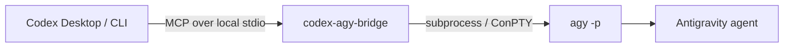

<div align="center">

# codex-agy-bridge

### A local MCP bridge between Codex and Google's headless Antigravity CLI

<p>
  <a href="https://github.com/crazyzhang277/codex-antigravity-bridge"></a>
  <a href="https://www.python.org/"></a>
  <a href="https://modelcontextprotocol.io/"></a>
  <a href="https://github.com/google-antigravity/antigravity-cli"></a>
</p>

<p><strong>Scope clearly · Delegate safely · Review the diff</strong></p>

<p>
  <a href="#quick-start">Quick Start</a> ·
  <a href="#mode-overview">Modes</a> ·
  <a href="#tool-api">Tool API</a> ·
  <a href="#parallel-worktree-workflow">Worktrees</a> ·
  <a href="../README.zh-CN.md">Chinese project overview</a> ·
  <a href="../README.md">English project overview</a> ·
  <a href="../PROGRESS.md">Chinese progress</a> ·
  <a href="../PROGRESS.en.md">English progress</a> ·
  <a href="../docs/README.en.md">Docs index</a>
</p>

<p><a href="../README.zh-CN.md">中文项目首页</a> · <a href="../README.md">English project overview</a></p>

</div>

> [!IMPORTANT]
> **CLI-only.** This project invokes Antigravity's headless `agy` CLI. It does not launch, embed, or control the Antigravity desktop GUI.

## 🧭 At A Glance

| Codex | Bridge | Antigravity |
| :---: | :---: | :---: |
| Plan · Split · Review | MCP · permissions · worktrees | Implement · Test · Report |



## 🧭 Mode Overview

This project has **four runtime modes**. `headless` and `terminal` are output
display options, not additional development modes. `Supervisor mode` is the
Codex safety and acceptance workflow, not a fifth agy process mode.

| Mode | Entry point | Tasks | Does Codex continue? | Worktree requirement | Best for |
| --- | --- | :---: | :---: | --- | --- |
| 1. Normal Codex development | No agy tool | 0 | Yes | Current worktree | Codex handles the task alone; agy is not invoked automatically |
| 2. Synchronous delegation | `agy_ask` / `agy_ask_json` | 1 | No, waits for the result | Caller-selected or inherited directory | One-shot analysis, read-only inspection, or structured output |
| 3. Async isolated task | `agy_start` + `agy_status` | 1 per job | Yes | Caller creates an isolated worktree first | Codex and one agy task work in parallel |
| 4. Collaboration MVP | `agy_collab_start` + `agy_collab_status` | 1 by default, 4 maximum | Yes | Bridge creates one worktree per task | Parallel frontend, backend, and test tracks |

### Display Options

| Display mode | Default | Behavior | Platform |
| --- | :---: | --- | --- |
| `headless` | ✅ | No window is opened; status and final output are returned through MCP | Windows, macOS, Linux |
| `terminal` | Off | One visible terminal window per running task shows live agy output | Windows |

Live terminal output is an **optional display setting for collaboration mode**,
not a fifth runtime mode. It does not change worktree isolation, branches,
permissions, or acceptance rules. The implementation uses a visible Windows
console; if Windows Terminal is configured as the default terminal application,
it may host the console, otherwise the system console host is used.

### Governance Rules

- Normal development never invokes agy automatically.
- The user must explicitly request delegation or collaboration first.
- Codex owns task splitting, shared contracts, file boundaries, tests, and manual merges.
- A collaboration session is capped at four tasks; each task gets one agy process, branch, and worktree.
- `ready_for_review` means only that the agy process exited successfully; it is not acceptance proof.
- The bridge never auto-merges, deletes worktrees, or executes arbitrary task commands.

### Choosing a Mode

```text
Codex only                    -> Normal Codex development
One agy answer                -> agy_ask / agy_ask_json
Codex continues + one agy task -> agy_start + agy_status
Codex backend + agy frontend  -> agy_collab_start + agy_collab_status
Watch live agy output         -> collaboration + display_mode="terminal"
```

The bridge exposes six local MCP tools. Synchronous tools run a bounded `agy -p` call and return cleaned output. Asynchronous tools start explicit jobs in a caller-provided workdir so Codex can continue working. The optional collaboration MVP creates isolated Git worktrees for a declared task list; Codex still reviews and merges the branches.

All public task tools reject a non-positive or non-finite `timeout` before starting a process or job. The default is `300.0` seconds for ordinary tools and `900.0` seconds for `agy_collab_start`.

## ✨ Why This Bridge

<table>
<tr>
<td width="25%"><strong>Native MCP</strong><br><sub>Use it from Codex Desktop or Codex CLI without a separate web service.</sub></td>
<td width="25%"><strong>CLI-first</strong><br><sub>Reuse `agy` login, workspace, and permission behavior.</sub></td>
<td width="25%"><strong>Windows-aware</strong><br><sub>Handle non-ASCII workdirs and retry empty output through ConPTY.</sub></td>
<td width="25%"><strong>Small surface</strong><br><sub>Local stdio, six tools, no database or SDK runtime.</sub></td>
</tr>
</table>

## 🚀 Quick Start

### 01 · 📋 Prerequisites

- Python 3.10 or newer.
- Antigravity CLI installed as `agy`.
- One completed interactive `agy` login.
- Codex Desktop or Codex CLI with MCP support.

On Windows PowerShell:

```powershell
irm https://antigravity.google/cli/install.ps1 | iex
agy --version
agy
```

On macOS or Linux, follow the [Antigravity CLI documentation](https://antigravity.google/docs/cli/overview), then run `agy` once to complete login.

### 02 · 📦 Install the bridge

From this directory:

```powershell
python -m pip install -e ".[dev,winpty]"
```

On macOS or Linux:

```bash
python -m pip install -e ".[dev]"
```

The `dev` extra installs pytest. The `winpty` extra enables the Windows ConPTY fallback. The package does not install or manage Antigravity OAuth credentials.

Register the installed package with Codex through the single setup command:

```powershell
codex-agy-bridge-setup --what-if
codex-agy-bridge-setup
```

The command installs the packaged skill, uses the current Python interpreter,
and updates only this server's managed proxy variables. It is idempotent and
does not read, save, or print OAuth credentials.

### 🌐 Per-user Proxy Configuration

Proxy ports are application-specific. Set an environment proxy or pass an
explicit address to the setup command:

```powershell
codex-agy-bridge-setup --proxy-url "http://127.0.0.1:7897"
codex-agy-bridge-setup --no-proxy
```

On macOS or Linux, set `PROXY_URL` before running the setup command. The
proxy is passed to the MCP child process through `HTTP_PROXY`, `HTTPS_PROXY`,
and `ALL_PROXY`; no TUN mode is required when the local proxy accepts HTTP
CONNECT or SOCKS5. URLs containing credentials are rejected.

### 03 · Register with Codex

```powershell
codex-agy-bridge-setup
codex mcp list
```

The bridge starts automatically over local MCP stdio. No separate HTTP server is required.

### CC Switch: configuration ownership and recovery

CC Switch is optional; it is not required to run this bridge. If CC Switch is
used to route Codex through another provider or to take over the local proxy,
its restart, startup recovery, proxy re-takeover, or abnormal-exit recovery may
rewrite `%USERPROFILE%\.codex\config.toml`. The rewrite can remove
`[mcp_servers.*]`, `[desktop]`, `[memories]`, project settings, and other Codex
UI configuration. An MCP server marked enabled in CC Switch's MCP database does
not guarantee that it exists in Codex's live configuration.

After every CC Switch restart or provider change, verify the live configuration:

```powershell
codex mcp list
Get-Content "$env:USERPROFILE\.codex\config.toml"
```

If `codex-agy-bridge` is missing from either the command output or the
`[mcp_servers.codex-agy-bridge]` section, let CC Switch finish proxy takeover
and register it again. Use a real local Python executable on Windows rather
than a Microsoft Store `python` shim:

```powershell
$python = "C:\path\to\python.exe"
codex mcp add codex-agy-bridge -- $python -m codex_agy_bridge

codex mcp list
```

Register MCP servers after CC Switch takeover and before creating a new Codex
conversation. Existing conversations may keep an already-loaded MCP while new
conversations fail. Provider hot-switching does not necessarily remove MCP
entries, but the restart/re-takeover path may overwrite them, so check again
after every restart. Track the upstream bug in [CC Switch issue #6265](https://github.com/farion1231/cc-switch/issues/6265).

<details>
<summary>Manual MCP configuration</summary>

```toml
[mcp_servers.codex-agy-bridge]
command = "python"
args = ["-m", "codex_agy_bridge"]
startup_timeout_sec = 120

[mcp_servers.codex-agy-bridge.env]
HTTP_PROXY = "http://127.0.0.1:7897"
HTTPS_PROXY = "http://127.0.0.1:7897"
ALL_PROXY = "http://127.0.0.1:7897"
NO_PROXY = "localhost,127.0.0.1"
```

</details>

## 🧰 Tool API

| Tool | Best for | Result |
| --- | --- | --- |
| `agy_ask` | A bounded synchronous task | Cleaned text |
| `agy_ask_json` | Structured CLI output | JSON text |
| `agy_start` | Explicit work in a caller-created worktree | `job_id` |
| `agy_status` | Polling an async job | Status and result JSON |
| `agy_collab_start` | Start bounded tasks in automatically created worktrees | Collaboration JSON |
| `agy_collab_status` | Aggregate task, worktree, and diff status | Collaboration JSON |

### `agy_ask`

```text
agy_ask(
  prompt: str,
  workdir: str = "",
  timeout: float = 300.0,
  dangerously_skip_permissions: bool = False,
) -> str
```

Use it for bounded tasks such as inspecting files, explaining code, or proposing documentation changes.

### `agy_ask_json`

```text
agy_ask_json(
  prompt: str,
  workdir: str = "",
  timeout: float = 300.0,
  dangerously_skip_permissions: bool = False,
) -> str
```

Use it when the prompt requires structured output. The bridge adds `--output-format json` internally, rejects unparseable output, and returns valid JSON text. The requested schema remains part of the prompt contract and must be checked by the supervisor.

### `agy_start` and `agy_status`

Use `agy_start` only with an explicit existing `workdir` pointing to a caller-created isolated worktree. The bridge does not create Git worktrees. Poll the returned job id with `agy_status`.

| State | Meaning |
| --- | --- |
| `queued` | Accepted and waiting to run |
| `running` | Antigravity process is active |
| `completed` | Process finished successfully |
| `failed` | Process finished with an error |
| `unknown` | Job is unavailable in this bridge process |

### `agy_collab_start` and `agy_collab_status`

The collaboration MVP is the shortest path for a front-end/back-end split. It
requires a Git repository root and a task list with exclusive file ownership.
Each task gets a temporary branch named `codex-agy/<session>/<task>` and a
worktree outside the project directory. The bridge starts all tasks through the
existing bounded job registry so Codex can continue coding in its own worktree.

```text
agy_collab_start(
  project_dir="C:/work/my-app",
  base_ref="HEAD",
  dry_run=true,
  shared_contract="Frontend consumes GET /api/items.",
  display_mode="headless",
  max_tasks=4,
  tasks=[
    {
      "id": "backend",
      "role": "Backend",
      "prompt": "Implement the items API and its tests.",
      "owned_paths": ["backend"],
      "acceptance": ["API tests pass"],
      "verification": ["python -m pytest backend"],
    },
    {
      "id": "frontend",
      "role": "Frontend",
      "prompt": "Implement the items page against the shared contract.",
      "owned_paths": ["frontend"],
      "acceptance": ["Frontend tests pass"],
    },
  ],
)
```

Use `dry_run=true` first. It validates the repository, base ref, task format,
owned-path overlap, branches, worktree paths, and acceptance metadata without
starting `agy`, creating a worktree, creating a job, or changing Git. Repeat
with `dry_run=false` only after reviewing the returned plan.

Required task fields are `id`, `prompt`, `owned_paths`, and `acceptance`.
Owned paths must not overlap. `agy_collab_status(session_id)` returns each
job state, branch, worktree path, committed, uncommitted, untracked, and deleted
files, plus `scope_status`, `scope_violations`, and a `diff_check` result.
`scope_status` is `passed`, `violated`, or `unknown`; violations are reported
for review and never silently reverted. `ready_for_review` means the agy
processes exited successfully; it does not mean the acceptance criteria have
passed.

The MVP never auto-merges, deletes worktrees, or runs arbitrary verification
commands. After reviewing the returned branches and running the listed checks,
Codex or the user merges them manually. Session state is kept in the current
bridge process, just like ordinary async jobs.

Before starting a session, Codex should ask whether the user wants live terminal
output and how many tasks to dispatch. The default is `display_mode="headless"`
and one task; `max_tasks` can never exceed four. With
`display_mode="terminal"` on Windows, each running task gets a visible console
window and agy's live output is shown there. The process exit code remains
available through `agy_collab_status`.

### Shared parameters

| Parameter | Default | Meaning |
| --- | --- | --- |
| `prompt` | required | Task instruction sent to Antigravity |
| `workdir` | `""` | Working directory; empty means inherited directory |
| `timeout` | `300.0` | Positive hard wall-clock limit in seconds |
| `dangerously_skip_permissions` | `false` | Adds the bypass flag when explicitly enabled |

Safe read-only example:

```text
Use agy_ask once. Inspect README.md and return three concrete improvements.
Keep the task read-only, use the repository root as workdir, and do not modify files.
```

## 🧩 Parallel Worktree Workflow

Use asynchronous work only for independent, well-bounded tasks.

Before calling `agy_start`, Codex should:

1. Define shared routes, components, state, and data contracts.
2. Write a plan under `docs/agy-plans/`.
3. Assign exclusive file boundaries and acceptance checks.
4. Create the AGY worktree.
5. Keep other processes away from the same files.

Each delegated task has at most three AGY calls: one initial implementation and at most two corrections. Stop when tests pass, the task exceeds its boundary, progress stops, the process times out, or a user decision is required.

Codex remains responsible for reviewing the diff, checking worktree state, running tests, and deciding whether to merge.

For the collaboration MVP, call `agy_collab_start` after the shared contract
and exclusive paths are known. Codex can then continue in its own worktree and
poll `agy_collab_status`. A `ready_for_review` session is only a handoff point;
the acceptance checks, diff audit, and manual merge remain explicit.

## ⚙️ Runtime Behavior

The runtime lives in `src/codex_agy_bridge/`:

1. `server.py` registers the six MCP tools with FastMCP.
2. `agy_runner.py` discovers the CLI through `AGY_PATH`, `PATH`, and platform defaults.
3. The runner builds `agy -p <prompt>` and optionally adds JSON output or the permission bypass.
4. Windows non-ASCII workdirs are converted to an ASCII short path when available.
5. Direct subprocess execution is attempted first; empty stdout triggers a ConPTY or POSIX `pty` retry.
6. ANSI escapes, carriage-return repainting, and TUI decoration are removed.
7. Nonzero exits, stderr, PTY failures, and empty-output failures are preserved as actionable diagnostics.
8. `agy_jobs.py` manages explicit asynchronous jobs in a bounded thread pool.
9. Completed jobs are retained for a finite period and the worker pool has an explicit shutdown path.
10. `agy_collaboration.py` validates task contracts, creates Git worktrees, starts parallel jobs, and aggregates review metadata without merging.
11. `run_agy_visible` optionally runs one task per visible Windows console while preserving the same job status contract.

## 🔧 Configuration

If `agy` is not on `PATH`, set `AGY_PATH`:

```powershell
$env:AGY_PATH = "C:\path\to\agy.exe"
```

If Codex Desktop cannot find Python, use Python's absolute path in the MCP configuration. Keep the launch command on an ASCII path when possible, but pass the actual project directory through `workdir`.

## 🔒 Security Boundary

- Communication stays on local MCP stdio.
- `dangerously_skip_permissions` defaults to `false`.
- Use the bypass only for trusted prompts, trusted workdirs, and reversible actions.
- Never commit OAuth material, proxy credentials, or private Codex configuration.
- Do not delegate production operations, irreversible actions, cross-project writes, or unclear tasks.

## ✅ Verification

Run from this directory:

```powershell
python -m pytest -q
python -m compileall -q src
```

The unit tests mock the process boundary and do not require a live Antigravity login.

For a layered real-machine check:

```powershell
agy -p "Reply exactly DIRECT_AGY_OK" --dangerously-skip-permissions
codex mcp list
```

Then call `agy_ask` from Codex with a small, reversible task.

## 🩺 Troubleshooting

<details>
<summary><code>agy</code> binary not found</summary>

Run `agy --version`. Install the CLI or set `AGY_PATH` to the full executable path.

</details>

<details>
<summary>Authentication required</summary>

Run `agy` interactively once and complete CLI login. The bridge does not store or manage OAuth credentials.

</details>

<details>
<summary>Proxy works only with TUN mode</summary>

TUN mode is not required when the proxy exposes a local HTTP CONNECT or SOCKS5 port. Run the repository installer to detect common ports, or pass the exact address with `-ProxyUrl`. The installer writes proxy variables only to the current user's `codex-agy-bridge` MCP configuration.

```powershell
powershell -ExecutionPolicy Bypass -File .\scripts\install.ps1 -ProxyUrl "http://127.0.0.1:7897"
```

</details>

<details>
<summary>Empty output from a headless call</summary>

Install the `winpty` extra on Windows. The runner retries through ConPTY on Windows or `pty` on POSIX when direct stdout is empty.

</details>

<details>
<summary>Async job is <code>unknown</code></summary>

Job state is kept in memory by one bridge process. If the MCP process restarted, the old job id is unavailable. Start again only after Codex has reviewed the existing worktree.

</details>

## 🗂️ Project Structure

```text
mcp-antigravity-bridge/
├── src/codex_agy_bridge/
│   ├── agy_runner.py    # CLI discovery, subprocess, PTY fallback, output cleanup
│   ├── agy_jobs.py      # asynchronous job registry
│   ├── agy_collaboration.py # collaboration contracts and Git worktrees
│   ├── server.py        # FastMCP tool registration
│   └── __main__.py      # python -m codex_agy_bridge entry point
├── tests/
│   ├── test_smoke.py
│   ├── test_mcp_stdio.py
│   ├── test_async_jobs.py
│   └── test_collaboration.py
├── examples/
│   └── codex-config.toml
├── pyproject.toml
├── README.md
└── README.en.md
```

## 🔗 References

- [Antigravity CLI](https://github.com/google-antigravity/antigravity-cli)
- [Antigravity CLI documentation](https://antigravity.google/docs/cli/overview)
- [Model Context Protocol](https://modelcontextprotocol.io/)
- [agy-headless-bridge](https://github.com/rhishi99/agy-headless-bridge)
- [agy-bridge](https://github.com/sshahzaiib/agy-bridge)

## 📄 License

Apache-2.0
