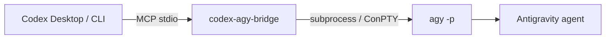

<div align="center">

# codex-agy-bridge

An MCP server that lets Codex call Google's Antigravity `agy` CLI headlessly.

<p>
  <a href="https://www.python.org/"></a>
  <a href="https://modelcontextprotocol.io/"></a>
  <a href="https://github.com/google-antigravity/antigravity-cli"></a>
  <a href="../LICENSE"></a>
</p>

🇨🇳 [简体中文项目首页](../README.md)

</div>

## Contents

- [Overview](#overview)
- [Quick Start](#quick-start)
- [Tool API](#tool-api)
- [Parallel Worktree Workflow](#parallel-worktree-workflow)
- [Runtime Behavior](#runtime-behavior)
- [Security Boundary](#security-boundary)
- [Verification](#verification)
- [Troubleshooting](#troubleshooting)

## 🚀 What it does

`codex-agy-bridge` exposes four local MCP tools. The synchronous tools run a
bounded `agy -p` call and return its cleaned result. The asynchronous tools
start a background call and let Codex continue work in a separate Git
worktree.

The supported integration is:



This project does **not** launch, embed, or control the Antigravity desktop GUI. It invokes the Antigravity CLI in headless mode.

## ✨ Why this bridge?

- **Native Codex integration:** register it as an MCP server and use it from Codex Desktop or Codex CLI.
- **CLI-first:** reuse `agy`'s own login, workspace, and permission flow.
- **Windows-aware:** support non-ASCII workdirs and retry through ConPTY when direct output is empty.
- **Small surface area:** four tools, local stdio transport, no web server, database, or SDK runtime.

## 🛠️ Prerequisites

- Python 3.10 or newer.
- The Antigravity CLI installed and available as `agy`.
- A completed interactive `agy` login before the first headless call.
- Codex Desktop or Codex CLI with MCP server support.

Install the Antigravity CLI on Windows PowerShell:

```powershell
irm https://antigravity.google/cli/install.ps1 | iex
agy --version
```

## 📦 Installation

For the fastest GitHub setup, run the repository installer from the root
README. It installs this bridge, the `agy-supervisor` skill, and an idempotent
Codex MCP registration in one step.

From this repository:

```powershell
cd mcp-antigravity-bridge
python -m pip install -e ".[dev,winpty]"
```

On macOS or Linux, the Windows-specific extra is not required:

```bash
python -m pip install -e ".[dev]"
```

The `dev` extra installs the local pytest dependency. The `winpty` extra enables the Windows ConPTY fallback.

The installer does not install or manage Antigravity OAuth credentials. Run
`agy` interactively once after installation and let the CLI manage its own
login state.

## 🔌 Register with Codex

The recommended command is:

```powershell
codex mcp add codex-agy-bridge -- python -m codex_agy_bridge
```

The bridge starts automatically over local MCP stdio. No separate HTTP server is needed.

For a checked-in or machine-specific configuration, use:

```toml
[mcp_servers.codex-agy-bridge]
command = "python"
args = ["-m", "codex_agy_bridge"]
startup_timeout_sec = 120
```

If Python is not on the desktop app's `PATH`, use its absolute path in `command`. If `agy` is not on `PATH`, set `AGY_PATH`:

```powershell
$env:AGY_PATH = "C:\path\to\agy.exe"
```

## 🧰 Tool API

### `agy_ask`

```text
agy_ask(
  prompt: str,
  workdir: str = "",
  timeout: float = 300.0,
  dangerously_skip_permissions: bool = False,
) -> str
```

Use it for normal text tasks such as inspecting files, explaining code, or running a bounded subtask.

### `agy_ask_json`

```text
agy_ask_json(
  prompt: str,
  workdir: str = "",
  timeout: float = 300.0,
  dangerously_skip_permissions: bool = False,
) -> str
```

Use it when the prompt asks Antigravity for structured output. Internally this adds `--output-format json` to the `agy` command; the tool still returns the result as text.

### `agy_start` and `agy_status`

Use `agy_start` for explicit parallel worktree collaboration. It returns a job
id immediately; poll that id with `agy_status` while Codex works in another
worktree. The job status is JSON text with `queued`, `running`, `completed`,
`failed`, or `unknown` state.

### Parameters

| Parameter | Meaning |
| --- | --- |
| `prompt` | The task or instruction sent to Antigravity. |
| `workdir` | Optional working directory for the `agy` process. An empty string inherits the current directory. |
| `timeout` | Hard wall-clock timeout in seconds. The default is `300.0`. |
| `dangerously_skip_permissions` | Adds `--dangerously-skip-permissions` when `true`; keep it `false` unless the prompt and workdir are trusted. |

## 🧭 Supervisor skill

The optional `agy-supervisor` skill makes Codex the supervisor and Antigravity
the bounded implementer. It is intentionally opt-in: ordinary development
requests do not call `agy`. Codex calls `agy_ask` only after the user explicitly
requests Antigravity collaboration or enables supervisor mode.

For multi-page work, Codex first fixes the shared contracts, writes a plan to
`docs/agy-plans/`, assigns exclusive file boundaries, creates an AGY worktree,
and starts AGY asynchronously. Codex continues in its own worktree, then
reviews and merges the AGY branch. A delegated task has at most three total
AGY calls, including two correction calls after the initial implementation.
The skill does not allow same-file concurrent writes, production operations,
secret handling, or irreversible actions.

## 🧭 How the runner works

The runtime lives in `src/codex_agy_bridge/`:

1. `server.py` registers the four MCP tools with FastMCP.
2. `agy_runner.py` looks for the CLI in `AGY_PATH`, then `PATH`, then platform-specific default locations.
3. The runner builds `agy -p <prompt>` and optionally adds `--output-format json` and `--dangerously-skip-permissions`.
4. On Windows, a non-ASCII workdir is converted to an ASCII short path when available.
5. The runner tries normal subprocess execution first. If stdout is empty, it retries through Windows ConPTY or POSIX `pty`.
6. ANSI escape sequences, carriage-return repaints, and TUI decoration are removed before the text is returned.
7. `agy_jobs.py` runs explicit asynchronous tasks in a bounded thread pool.

The public MCP tools return the cleaned text. The internal runner also tracks the process exit code and whether a PTY was used.

## 🪟 Windows notes

- Install the optional fallback with `python -m pip install -e ".[winpty]"`.
- Keep the MCP launch command on an ASCII path when possible.
- Pass the real project directory through `workdir`; do not hard-code a machine-specific `cwd` in the MCP registration.
- If Windows cannot provide a short path for a non-ASCII directory, the runner falls back to an inherited cwd and passes the original directory through `--add-dir`.
- If `agy` works in an interactive terminal but not through Codex, check `AGY_PATH`, inherited environment variables, and the CLI login state.

## 🔐 Security boundary

- The bridge communicates with the MCP client over local stdio.
- `dangerously_skip_permissions` defaults to `false`.
- Enabling the bypass lets headless `agy` operations proceed without interactive permission prompts. Use it only for trusted prompts, trusted workdirs, and reversible actions.
- Never commit Antigravity OAuth material, proxy credentials, or private Codex configuration.

## 🧪 Verification

Run the local checks from this directory:

```powershell
python -m pytest -q
python -m compileall -q src
```

The unit tests mock the process boundary, so they do not require a live Antigravity login. For a layered real-machine check:

```powershell
agy -p "Reply exactly DIRECT_AGY_OK" --dangerously-skip-permissions
codex mcp list
```

Then call `agy_ask` from Codex with a small, reversible task.

## 🩺 Troubleshooting

### `agy binary not found`

Run `agy --version`. If the command is not available, install the CLI or set `AGY_PATH` to the full executable path.

### `Authentication required`

Run `agy` interactively once and complete the CLI login. The bridge does not store or manage OAuth credentials.

### Empty output from a headless call

Install the `winpty` extra on Windows. The runner automatically retries through ConPTY on Windows or `pty` on POSIX when direct stdout is empty.

### `agy timed out after ...s`

Increase the tool's `timeout` for a genuinely long task, or reduce the prompt's scope. The timeout is a hard wall-clock limit for the child process.

### Async job is `unknown`

Job state is kept in memory by one bridge process. If the MCP process restarted,
the old job id is no longer available; start the task again and keep the
worktree unchanged until Codex has reviewed the result.

## 🗂️ Project structure

```text
mcp-antigravity-bridge/
├── src/codex_agy_bridge/
│   ├── agy_runner.py    # CLI discovery, subprocess, PTY fallback, output cleanup
│   ├── agy_jobs.py      # asynchronous job registry
│   ├── server.py        # FastMCP tool registration
│   └── __main__.py      # python -m codex_agy_bridge entry point
├── tests/
│   ├── test_smoke.py
│   └── test_async_jobs.py
├── examples/
│   └── codex-config.toml
├── pyproject.toml
└── README.md
```

## 🔗 References

- [Antigravity CLI](https://github.com/google-antigravity/antigravity-cli)
- [Antigravity CLI documentation](https://antigravity.google/docs/cli/overview)
- [Model Context Protocol](https://modelcontextprotocol.io/)
- [agy-headless-bridge](https://github.com/rhishi99/agy-headless-bridge)
- [agy-bridge](https://github.com/sshahzaiib/agy-bridge)

## License

Apache-2.0
