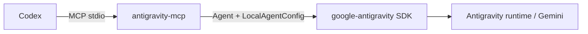

# antigravity-mcp

基于 Google Antigravity 官方 Python SDK 的 MCP 原型。它适合研究 SDK 的多轮对话、流式响应和工具控制；生产使用建议先选择上层目录的 [`mcp-antigravity-bridge`](../mcp-antigravity-bridge/)。

## 定位

这个原型不启动 `agy` CLI，而是在 MCP server 进程内创建 SDK agent：



每次 `run_agy` 调用都会创建一个短生命周期 agent，并收集 `response.text()`。

## 安装

```powershell
cd mcp-server
python -m pip install -e ".[dev]"
```

主要依赖：

```text
Python >= 3.10
fastmcp >= 3.4
google-antigravity >= 0.1.9
```

## 认证

SDK 可以使用自己的环境配置，也可以通过工具参数传入 `api_key`。不要把 API key 写入 Git 仓库或提交到配置文件。

如果使用 Gemini API key，可以在启动 Codex 前设置：

```powershell
$env:GEMINI_API_KEY = "your-key"
```

也可以使用 SDK 支持的 Vertex AI / ADC 配置。

## 注册到 Codex

```toml
[mcp_servers.antigravity]
command = "python"
args = ["-m", "antigravity_mcp"]
cwd = "C:\\path\\to\\codex-antigravity-bridge\\mcp-server"
```

或者直接运行：

```powershell
python -m antigravity_mcp
```

## 工具：`run_agy`

```text
run_agy(
    prompt: str,
    cwd: str = "",
    api_key: str = "",
    model: str = "",
) -> str
```

| 参数 | 必填 | 说明 |
| --- | --- | --- |
| `prompt` | 是 | 发给 Antigravity 的任务描述 |
| `cwd` | 否 | SDK 的 workspace 根目录 |
| `api_key` | 否 | 单次调用的 Gemini API key 覆盖值 |
| `model` | 否 | 单次调用的模型标识，留空使用 SDK 默认值 |

`cwd` 会映射到 `LocalAgentConfig(workspaces=[...])`。空字符串表示使用 SDK 默认 workspace。

## 测试

```powershell
python -m pytest -q
```

测试会 mock `Agent`、`LocalAgentConfig` 和响应对象，不会发起网络请求，也不要求本机已经完成 Antigravity 登录。

## 文件结构

```text
antigravity_mcp/
├── agy_runner.py    # SDK 生命周期、workspace、超时和错误映射
├── server.py        # FastMCP 工具注册
└── __main__.py      # python -m antigravity_mcp 入口
```

## 与 CLI bridge 的区别

| 项目 | CLI bridge | SDK prototype |
| --- | --- | --- |
| 进程模型 | 启动 `agy` 子进程 | Python 进程内创建 agent |
| 非 TTY 回退 | 支持 ConPTY / pty | 不适用 |
| 认证 | 由 CLI 管理 | 由 SDK 环境或 `api_key` 管理 |
| 推荐用途 | 日常 Codex 委托 | SDK 能力实验 |

## License

Apache-2.0
